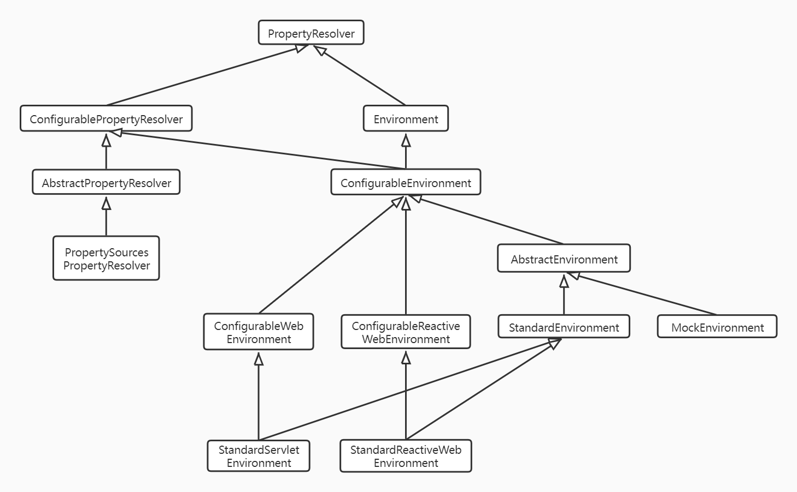

# 1.PropertyResolver相关类结构（不同版本会有变动）

- PropertyResolver：针对任何潜在属性的解析接口,占位符`${..}`操作在此定义
- ConfigurablePropertyResolver：增加了类型转换功能(通过ConfigurableConversionService)
    - AbstractPropertyResolver：解析任何潜在源属性的基类
    - PropertySourcesPropertyResolver：实现根据一组底层的PropertySources解析属性值
- Environment：表示当前应用程序运行环境的接口，主要对外开放使用的就是这个接口
    - ConfigurableEnvironment：允许对数据源进行操作的环境接口
    - AbstractEnvironment：Environment实现的抽象基类，支持保留默认配置文件名称的概念，并允许通过ACTIVE_PROFILES_PROPERTY_NAME和DEFAULT_PROFILES_PROPERTY_NAME属性指定活动和默认配置文件
        - 各子类仅仅是PropertySource不同
    - MockEnvironment：公开了setProperty和withProperty方法用于测试
    - StandardEnvironment：适用于“标准”（即非网络）应用程序的Environment实现，添加了两个属性源
        - 系统环境属性源：systemEnvironment
        - JVM系统属性源：systemProperties
    - ConfigurableWebEnvironment：允许在ServletContext和ServletConfig(可选)可用的最早时刻初始化与servlet相关的PropertySource对象
    - StandardServletEnvironment：基于Servlet的Evironment实现
        - 所有与Web相关（基于servlet）的ApplicationContext类都会初始化一个实例
        - 增加了三种属性源：servletContextInitParams,servletConfigInitParams 和 jndiProperties
    - ConfigurableReactiveEnvironment：由基于Reactive的Web应用程序使用的Environment实现
    - StandardReactiveWebEnvironment: 上面接口的实现，未做扩展

# 2.Environment详细说明
1. 应用程序环境的两个关键概念：配置文件与属性
    - PropertyResolver中定义了属性相关的操作
    - Environment作用是确定激活的配置文件和默认生效的配置文件
        - 仅当给定的配置文件处于活动状态(active)时才向容器注册，才会生效
2.Environment为属性提供了更方便用户使用的接口：
    - Application管理的Bean可以注册为EnvironmentAware或注入Environment,以便直接查询配置文件状态或解析属性
3. 环境对象的配置操作必须通过ConfigurableEnvironment接口进行操作
    - 从所有AbstractApplicationContext子类的getEnvironment()方法返回

