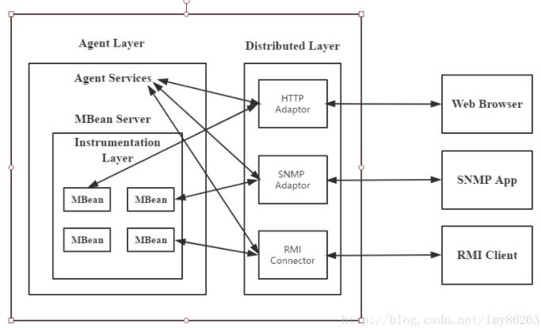

# 1.JMX简介
- Java Management Extensions，java监控扩展框架
- API在以下包：
    - java.lang.management
    - javax.management.*

# 2.集中管理和监
- 监控硬件和平台的运行情况：包括服务器和操作系统等
- 合理配置资源：比如内存的配置是否合理，CPU是否足够强大
- 收集应用运行的情况
- 在应用发生异常时能够及时定位问题所在

# 3.JMX的术语
- 管理资源
- MBean：对抽象的资源的一个描述
- MBean Server：MBean容器，管理一组MBeans，整个JMX管理环境的核心
- JMX Agent：JMX代理，MBean Server容器，提供一系列的服务来管理一系列的MBeans
- Protocol adapters and connectors：JMX Agent中的对象，将代理暴露给不同的管理应用和协议
- 通知Notification：封装了具体的事件和相应的数据，由MBean和MBeanServer发出

# 4.JMX的架构

- 分发层（Distributed layer）：包含可以使管理应用与JMX Agents交互的组件
- 代理层（Agent layer）：包含JMX Agent以及它们包含的MBean Servers
- 指示层（Instrumentation layer ）：包含代表可管理资源的MBeans。该层是最接近管理资源的

# 5.JMX的简单使用步骤
1. 创建MBean
2. 创建MBean Server
3. 将MBean注册到MBean Server中
4. 创建一个Adaptor方便访问：HtmlAdaptorServer
    - 需要jmxtool.jar包

# 6.rmi远程方法调用获取MBean
- MBean 包含在 Domain 里，Domain 相当于是一套独立的空间，这个空间里可以定义各种 type，各种 name 的 ObjectName
- 通过 ObjectName 可以获取到 MBean 的各种信息，包括属性、操作、通知

# 7.常用的 MBean
JDK 提供了一个 ManagementFactory，帮助我们方便的获取常用的 MBean
- OperatingSystemMXBean：可以获取操作系统相关的信息，机器名称、内存使用、CPU使用等信息
- RuntimeMXBean：可以获取当前 JVM 的信息，包括 JVM 参数和 JVM 相关的系统参数
- MemoryMXBean：可以获取当前 JVM 的内存使用，包括堆内存和非堆内存
- ClassLoadingMXBean：获取 JVM 类加载情况，包括已加载类、未加载类等
- GarbageCollectorMXBean：获取 JVM 垃圾收集器的情况，包括使用的哪种垃圾收集器以及回收次数等等
    - ManagementFactory.getGarbageCollectorMXBeans()获取
    - 获取到的是一个集合，因为垃圾收集器分为老年代和新生代两个
