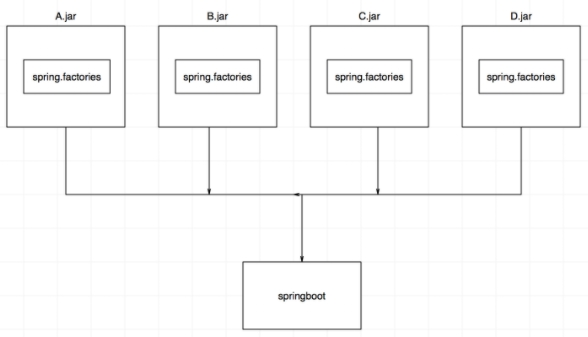

# 1.SpringFactoriesLoader简介
- 框架内部使用的通用工厂加载机制
- 从classpath下多个jar包特定的位置读取文件并初始化类
- 文件内容必须是kv形式，即properties类型
- key是全限定名【抽象类接口】、value是实现，多个实现用逗号【,】分割

# 2.示意图：

# 3.主要方法
- `loadFactories`：使用给定的类加载器从"META-INF/spring.factories"加载并实例化给定类型的工厂实现
- `loadFactoryNames`：根据给定的类型加载类路径的全限定名
- `instantiateFactory`：实例化Bean对象

# 4.BeanInfo java.beans中的接口
BeanInfo只是一个内省结果的接口
- Spring自定义了一个内省结果类型，叫ExtendedBeanInfo，主要用于识别返回值不为空的Setter方法

BeanInfo相关方法：
- getBeanDescriptor：bean整体信息
- getEventSetDescriptors：触发的事件描述
- getDefaultEventIndex：默认事件索引,没有为-1
- getPropertyDescriptors：所有属性描述
- getDefaultPropertyIndex：默认属性索引,没有为-1
- getMethodDescriptors：所有方法描述
- getAdditionalBeanInfo：返回当前bean附加的其他BeanInfo
- getIcon：返回可用于在工具箱或工具栏中表示 bean 的图像

java.beans.Introspector类：
- 发现Java类是否符合JavaBean规范如果有的框架或程序用到了Introspector类,那么就会启用一个系统级别的缓存,此缓存会 存放一些曾加载并分析过的JavaBean的引用

# 5.BeanInfoFactory springframework提供的接口
- 用来生成指定的Bean Class的描述类BeanInfo
- ExtendedBeanInfoFactory中的getBeanInfo 每次返回的是新的BeanInfo对象，内部没有作缓存

# 6.CachedIntrospectionResults 缓存内省结果
- Spring 在应用程序ClassLoader自己缓存 bean 描述符，使用Java的Instrospector缓存可能会造成内存泄漏(springboot项目停止而缓存未清理)
- 建议在web.xml中声明一个IntrospectorCleanupListener来防止多ClassLoader布局，可以有效使用缓存
- IntrospectorCleanupListener：专门用来处理Introspector内存泄漏问题的辅助类

# 7.SpringFactoriesLoader在启动时会加载以下接口实现：具体参考源码
- `PropertySourceLoader`：用于加载PropertySource，可以扩展新增支持别的格式的配置文件
- `SpringApplicationRunListener`：run方法监听器
- `SpringBootExceptionReporter`：用户自定义异常处理回调接口
- `ApplicationContextInitializer`：在spring容器刷新之前初始化Spring ConfigurableApplicationContext的回调接口
- `ApplicationListener`：监听器
- `EnvironmentPostProcessor`：配置文件的集中管理，而不需要每个项目都去配置配置文件，一个扩展接口
- `FailureAnalyzer`：FailureAnalyzer用于分析故障并提供可显示给用户的诊断信息
- `FailureAnalysisReporter`：向用户报告FailureAnalysis
