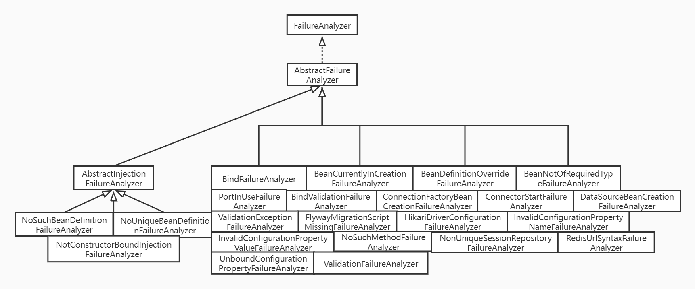

# 1.FailureAnalyzer简介
用于分析故障并提供可显示给用户的诊断信息的接口

# 2.如何使用
1. 自定义异常
2. 自定义FailureAnalyzer处理该异常
3. 将自定义FailureAnalyzer注册到`resources/META-INF/spring.factories`
4. 抛出异常则程序会启动失败

# 3.FailureAnalysis
FailureAnalyzer的分析结果

# 4.FailureAnalysisReporter
向用户报告FailureAnalysis
- 只有一个实现：LoggingFailureAnalysisReporter

# 5.结构示意图(包含auto-configure包)

具体说明：每个实现都对应一个Exception

FailureAnalyzer：故障分析接口
- AbstractFailureAnalyzer：大多数FailureAnalyzer实现的抽象基类
    - AbstractInjectionFailureAnalyzer：处理注入失败
        - NoSuchBeanDefinitionFailureAnalyzer：没有Bean
        - NoUniqueBeanDefinitionFailureAnalyzer：Bean不唯一
        - NotConstructorBoundInjectionFailureAnalyzer：未绑定构造器
    - BindFailureAnalyzer：分析BindException
    - BeanCurrentlyInCreationFailureAnalyzer：分析BeanCurrentlyInCreationException，创建异常
    - BeanDefinitionOverrideFailureAnalyzer：重复bean异常
        - DefaultListableBeanFactory.isAllowBeanDefinitionOverriding()为false 
    - BeanNotOfRequiredTypeFailureAnalyzer：未获取对应类型
    - PortInUseFailureAnalyzer：端口被占用
    - BindValidationFailureAnalyzer：分析BindValidationException或validation.BindException
    - ConnectionFactoryBeanCreationFailureAnalyzer：r2dbc连接失败
    - ConnectorStartFailureAnalyzer：tomcat启动失败，端口冲突或不正确的SSL配置
    - DataSourceBeanCreationFailureAnalyzer：jdbc创建datasource失败
    - ValidationExceptionFailureAnalyzer：校验异常
    - FlywayMigrationScriptMissingFailureAnalyzer：当没有可用的 Flyway 迁移脚本时抛出异常
    - HikariDriverConfigurationFailureAnalyzer：当我们无法使用 JDBC 连接到 RDBMS 时抛出致命异常
    - InvalidConfigurationPropertyNameFailureAnalyzer：当ConfigurationPropertyName包含无效字符时
    - InvalidConfigurationPropertyValueFailureAnalyzer：当配置属性值无效时抛出异常
    - NoSuchMethodFailureAnalyzer：NoSuchMethodError，正常情况下会在编译时抛出
    - NonUniqueSessionRepositoryFailureAnalyzer：当多个SessionRepository实现可用而无法知道应该使用哪个实现时抛出异常
    - RedisUrlSyntaxFailureAnalyzer：Redis URL 格式错误或无效时抛出的异常
    - UnboundConfigurationPropertyFailureAnalyzer：当ConfigurationPropertySource元素未绑定时抛出BindException 

