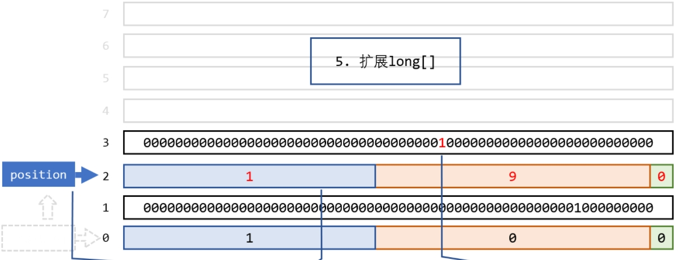

# 1.JavaEWAH简介
- Java Bitset 类的字对齐压缩变体，字对齐压缩的目标不是实现最佳压缩，而是提高查询处理时间
- JavaEWAH 还支持内存映射文件：我们可以将位图序列化到磁盘，然后使用 java.nio 类将它们映射到内存
- JavaEWAH 提供的压缩位图的缺点之一是随机访问速度较慢
- RoaringBitmap提供了比JavaEWAH更快的随机访问

# 2.实际运用场景
- Hive 及其衍生产品
- Git

# 3.简单压缩原理
基于行程压缩算法进行压缩的
1. RunningLengthWord
    - 存储了EWAHCompressedBitmap的全部数据，是整个项目中的核心
    - 基本类型为long，将bitmap每64位拆分为一个long数组(Buffer)
        - 64位全0或全1，压缩
        - 64位有0有1，不压缩
2. position：始终指向最后一个run-length
3. run-length：64位，被分为3部分
   - 最低位：表示当前压缩的是0还是1
   - 中间32位：表示当前的run-length压缩了几个64位
   - 高31位：表示当前run-length后面紧接着未压缩的值的数量(64位一组)
4. 示例，插入9和666

    - `1 9 0`表示后面还有1个未压缩的long，中间有9个全是0的long