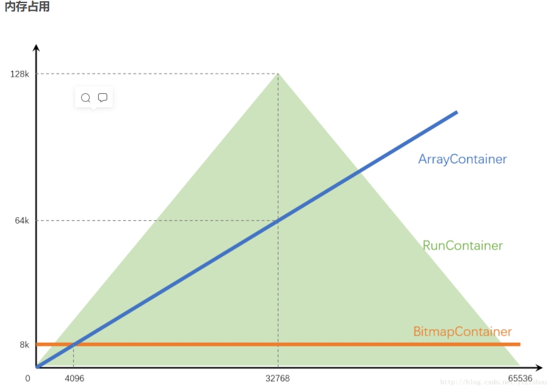

# 1.RoaringBitMap概述
Roaring bitmaps是一种超常规的压缩BitMap。它的速度比未压缩的BitMap快上百倍

# 2.使用场景
- Spark
- Kylin
- Hive
- Lucene
- ES
- .....很多

# 3.其他介绍
- `RoaringBitmap`：最常用的位图 32位int

内存映射位图：
- `ImmutableRoaringBitmap `：磁盘上的位图
- `MutableRoaringBitmap`：java内存中的位图

可以进行Kryo序列化

64位扩展，对long的支持：
- `Roaring64NavigableMap`：依靠红黑树
- `Roaring64Bitmap`：依赖于 ART 数据结构来保存键/值对 https://db.in.tum.de/~leis/papers/ART.pdf

`RangeBitmap`：支持范围查询
- 可以写入磁盘和内存映射

# 4.数据结构及原理

- 每个RoaringBitmap包含一个RoaringArray，名为highLowContainer，存储了全部数据
- RoaringArray包含三个核心
    - keys：每个32位整形的高16位
    - values：低16位
    - size
- 三种Container：
    - ArrayContainer：short[]，将16位value直接存储，始终有序，不重复
    - BitmapContainer：使用long[]存储位图数据
        - 只有BitmapContainer可根据下标直接寻址，其余两个都是二分查找
    - RunContainer：Run指的是行程长度压缩算法，对连续数有比较好的压缩效果
        - 对于连续出现的数字，只记录初始数字和后续数量
            - 对于数列11，它会压缩为11,0；
            - 对于数列11,12,13,14,15，它会压缩为11,4；
            - 对于数列11,12,13,14,15,21,22，它会压缩为11,4,21,1；

RoaringBitmap针对Container的优化策略：
1. 创建
    - 创建包含单个值的Container时，选用ArrayContainer
    - 创建包含一串连续值的Container时，比较ArrayContainer和RunContainer，选取空间占用较少的
2. 转换：
    - ArrayContainer
        - 插入值后容量超过4096，则自动转换为BitmapContainer
        - 调用`runOptimize()`方法时，会比较和RunContainer的空间占用大小，选择是否转换为RunContainer
    - BitmapContainer：
        - 如果删除某值后容量低至4096，则会自动转换为ArrayContainer
        - 调用runOptimize()方法时，会比较和RunContainer的空间占用大小，选择是否转换为RunContainer
    - RunContainer：
        - 只有在调用runOptimize()方法才会发生转换，会分别和ArrayContainer、BitmapContainer比较空间占用大小，然后选择是否转换
 3. 三种Container内存占用图：
  
 

