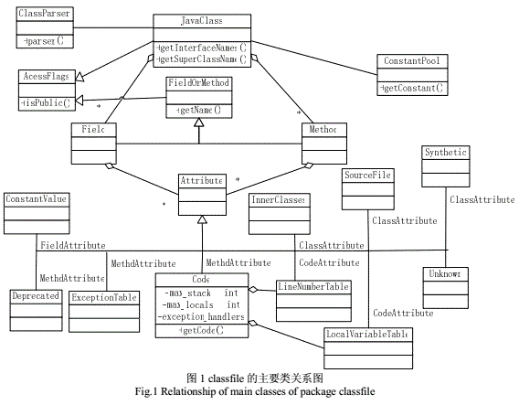
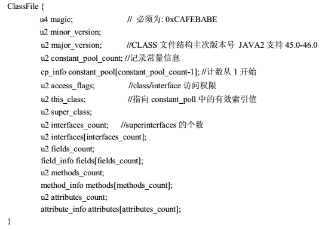

# 1.Commons-Bcel概述
Apache Commons的一个子项目，主要用于分析、创建、操纵Java  class文件

BCEL与Javassist的区别
- BCEL在JVM汇编程序语言级别上工作，而不是Javassist提供的源代码接口
- BCEL类似ASM,操作的是Java字节码

# 2.JVM结构
JVM是Java提供平台无关性的基础，它是一台抽象的机器，主要任务是装载class文件并且执行其中的字节码

JVM主要结构如下：
- **类装载子系统**：每个Java虚拟机都有一个类装载子系统，它根据给定的全限定名来装入类或接口。
- 运行时数据区：用于组织需要内存来存储的东西，如，字节码，程序创建的对象，传递给方法的参数，返回值，局部变量，运算的中间结果，……
- **Java堆**：存放运行时创建的对象实例，以及对象间的引用关系
- **Java栈**：其实更准确的称呼应该是“Java Virtual Machine Stack”，每当一个方法被执行的时候，都会创建一个Java栈帧（stack frame），栈帧中保存着该方法的操作数栈、局部变量表（local variable table）、动态链接、方法出口等信息，栈帧创建后就会放到Java栈上，执行完毕后抛弃该栈帧。
    - 我们平时所说的方法内的局部变量保存在“栈”上其实就是指Java栈。
- **方法区**：保存被虚拟机加载的类信息、常量、静态变量、即时编译器编译后的代码等数据。
    - 注意方法区中包含有一个运行区常量池，class文件中的常量池（将在后面讲解）中的内容将在类加载后存放到这个运行时常量池中。
- **程序计数器**（PC计数器）：PC寄存器的值总是指示下一条将被执行的指令
- **本地方法栈**：用于本地方法的执行

# 3.Bcel源码结构
- classfile包：主要用于查看class文件的结构（尤其是在没有源代码的情况下），一般不用作byte code的修改
    - JavaClass类：具有Class的功能，还提供了用于更改类的方法
    - Field：属性
    - Method：方法
    - LineNumber：行号
    - ConstantClass：外部类引用
    - ConstantPool：类文件中的常量池
    - Deprecated：标识一个已弃用的方法
    - RuntimeInvisibleAnnotations：类文件可见但是不供给给java的注解
    - RuntimeVisibleAnnotations：表示在类文件中表示并提供给 JVM 的注解
    - Code：此类表示方法中包含的一段 Java 字节码。 它由Attribute.readAttribute()方法实例化。 
        - Code属性包含有关操作数堆栈、局部变量、字节码和在此方法中处理的异常的信息
    - ClassParser：解析并返回一个JavaClass
    - ...还有很多，以后再深入研究
- generic包：动态产生或是修改class文件，可以插入代码、从class文件中剔除无用代码、实现一个Java编译器的代码生成器后端
    - ClassGen类：创建新类的起点
    - MethodGen：生成方法
    - FieldGen：生成属性
    - FieldGenOrMethodGen：生成属性或方法
    - ConstantPoolGen：生成常量池
    - LineNumberGen：该类表示方法内的行号，即给指令一个与源代码行对应的行号
    - LocalVariableGen：表示方法中的局部变量。 它包含其范围、名称和类型
    - ElementValueGen：生成元素值
    - Type：指明域类型
    - ...
- util包：工具类
    - Repository接口：处理解析二进制文件
- verifier包：校验字节码相关

# 4.classfile包结构图

# 5.javaClass类文件结构

# 6.ClassGen创建过程
## 6.1 Type确定类型
确定如何表示类型——域需要指明其类型，方法则需要给出参数及其返回值的类型

## 6.2 创建域和方法
- 域需要使用FieldGen来创建，并且需要指定其访问权限
- 方法则需要添加可能需要的异常、local variables、exception handler
- 由于包含有byte code的地址的引用，这两者被称之为instruction targeter
- 一般方法（不是抽象方法）会指向一个instruction list（包含instruction对象），对byte code地址的引用由instruction对象处理
    - 当instruction list更新时，instruction targeter也会被更新

## 6.3 Instructions
- instruction包含有 opcode(有时叫做tag)，字节长度，在byte code中的偏移量
- InstructionConstants用于提供预定义的常量供用户使用（flyweight模式）
- 所有指令都可以通过accept(Visitor v)方法来访问（visitor模式）

## 6.4 InstructionList（instruction handle）
- 对instructions的引用不是由直接指向instruction的指针，而是指向instruction handle的指针
- 这使得添加、插入、删除byte code很方便，同时允许重用不可变的指令对象（flyweight object）
- 由于使用符号引用，具体的bytecode偏移量的计算直到finalization才计算即可，即用户停止操作bytecode的时候
- instruction handle通过addAttribute()方法可以包含有用户自定义数据
- InstructionList操作：
    - append
    - insert
    - delete
    - finalize

## 6.5 InstructionFactory
- 用户可以使用InstructionFactory类创建指令（提供了很多有用的方法用于创建指令）
- 也可以使用compound instruction复合指令：当产生byte code，某些“模式”出现的比较频繁，比如算术或是比较运算
    - 可以用一个compound instruction（一个只有单一的一个getInstructionList()方法的接口），这可以用于任何位置，尤其是添加操作
