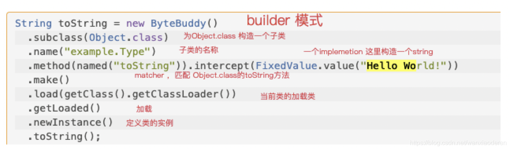

# 1.Bytebuddy概述
- 基于ASM的代码修改和生成工具
- runtime期动态生成和修改
- 使用简单，无需理解字节码

# 2.总体组成
- wave-framework : 多种代理框架或者修改字节码框架的对比
- classLoader： bytebudd使用classLoader的加载策略，wrap ,child-first, injection
- class-wave: 构造新类的方式，redefine，rebase, subclass后面会介绍
- matcher: 运行时判断一个类是不是目标类，bytebuddy提供一堆内置的matcher
- implementation: 实现，目的是描述字节码如何转化

# 3.基本使用 创建类

# 4.目录
- demo01：创建类和对象，调用方法
- demo02：
    - 方法代理(委托)
    - 重写方法，添加字段
- demo03：
