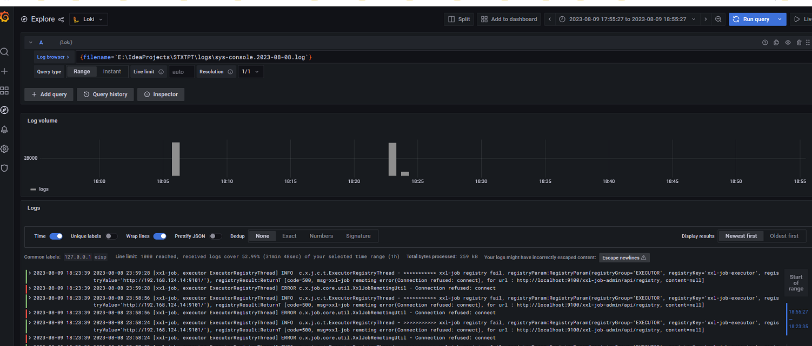

# 参考地址

## 部署
github
- https://kgithub.com/grafana/loki

官网
- https://grafana.com/docs/loki/latest/

windows本地 Loki+Promtail+Grafana
- https://blog.csdn.net/qq_39168874/article/details/130974603

Promtail 配置文件说明
- https://blog.csdn.net/JineD/article/details/127092849

Loki & Promtail 详解
- ://blog.csdn.net/weixin_43064185/article/details/129625265

## 整合

# 踩坑

LogQL 转义字符串: 使用反引号

