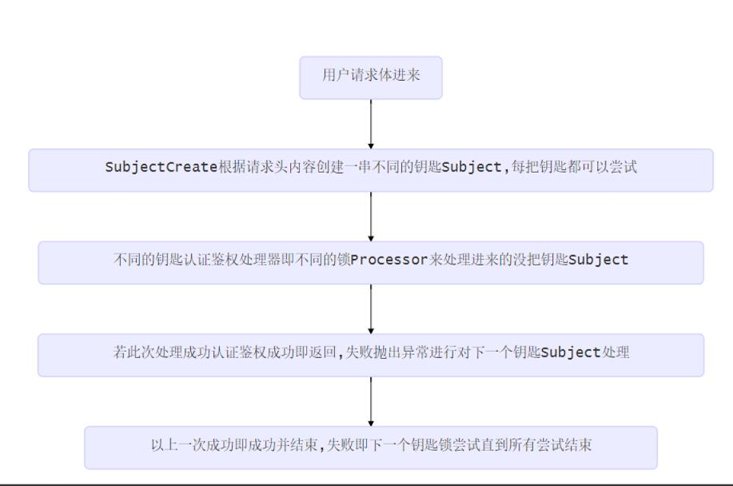

# 1、Provider接口
- SurenessAccountProvider：用户的账户密钥信息接口,实现从数据库,文本等加载数据，加载到需要账户数据的processor中
- PathTreeProvider：源的数据源接口,实现从数据库,文本等加载数据,加载到对应的资源权限匹配器DefaultPathRoleMatcher中

# 2、数据源
- 文本数据源使用sureness.yml配置数据
- 注解数据源的注解@RequiresRoles,@WithoutAuth

# 3、扩展点
- Subject: 认证鉴权对象接口,提供访问对象的账户密钥,请求资源,角色等信息
- SubjectCreate: 创建Subject接口,根据请求内容创建不同类型的Subject对象
- Processor: Subject处理接口,根据Subject信息,进行认证鉴权
- PathTreeProvider: 资源的数据源接口,实现从数据库,文本等加载数据
- SurenessAccountProvider: 用户的账户密钥信息接口,实现从数据库,文本等加载数据

