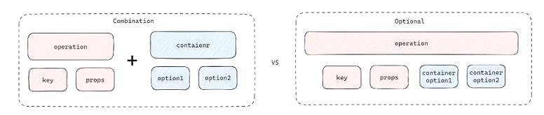

# 0.参考地址
官网
- https://gitee.com/opengoofy/crane4j
- https://createsequence.gitee.io/crane4j-doc/#/


# 1.概述
字段填充框架，从各种数据源中 —— 比如 RPC 接口、枚举、字典或者 DB —— 根据外检查询出各种关联信息，并将其部分字段填充到最终返回的对象上

# 2.基本概念
- 全局配置：Crane4jGlobalConfiguration
- 数据源容器：Container，Containers工厂类，创建完注册到全局配置
- 操作配置&解析器：
    - 装配操作:AssembleOperation，@Assemble注解
    - 拆卸操作：DisassembleOperation，@Disassemble注解
    - 类操作配置：BeanOperations
    - 操作配置解析器：BeanOperationParser
- 操作执行器:
    - AsyncBeanOperationExecutor：异步执行一次
    - DisorderedBeanOperationExecutor：同步执行一次，默认
    - OrderedBeanOperationExecutor：顺序执行，多次
- 填充方式：
    - 自动填充：基于 SpringAOP 实现，支持在方法调用前后自动填充方法的入参或者返回值；
    - 手动填充：基于操作执行器或 OperateTemplate 手动触发填充；细粒度
- 配置风格：
  
    - @ContainerMethod：组合式
    - @AssembleMethod：选项式

# 3.使用步骤
1. 启用配置：在全局配置文件中添加@EnableCrane4j注解
2. 配置数据源: SourceConfig
3. 配置填充操作：在类中配置 Foo
4. 触发填充：TestService

# 4.基础
## 4.1 声明装配操作
Test01
所有的 @Assemble 注解都支持在类或类的属性上使用
- 属性声明：Test01/Foo01
- 类声明
- 重复声明

### 4.1.1 显式指定key类型
keyType：Test01/Foo02

### 4.1.2  属性映射策略
- propertyMappingStrategy 
- OverwriteNotNullMappingStrategy
- ReferenceMappingStrategy:仅当 ref 对应的目标属性为 null 时，才获取 src 的属性值
- keyType：Test01/Foo03

自定义策略
- PropertyMappingStrategy 创建自定义策略
- Test01/CustomPropertyMappingStrategy

### 4.1.3 表达式支持
在 Spring 环境中，你可以在 @Assemble 注解的 container 属性里引用一些配置文件属性

## 4.2 配置属性映射
Test02
### 4.2.1 属性到属性
Test02/Foo01
- 自动类型转换：ConverterManager实现
### 4.2.2 对象到属性
Test02/Foo02
### 4.2.3 属性到键
Test02/Foo03
### 4.2.4 对象到键
Test02/Foo04
### 4.2.5 批量映射
Test02/Foo05
### 4.2.6 属性映射模板
Test02/Foo06
### 4.2.7 链式操作符
Test02/Foo07
- ChainAccessiblePropertyOperator：手动实现

## 4.3 数据源容器
Test03/TestContainer
### 4.3.1 Map容器
Test03/Test01Map
### 4.3.2 枚举容器
- Test03/Test02Enum：创建容器
- Test03/Test02Enum02：可配置项
- 批量扫描: 配置文件
  ```java
    @EnableCrane4j(
        enumPackages = "com.example.demo" // 要扫描的枚举包路径
    )
    @ContainerEnumScan(
      includePackages = "com.example.demo",  // 要扫描的包路径
      excludeClasses = { NoScanEnum.class }, // 排除指定的类
      includeClasses = { NeedScanEnum.class } // 包含指定的类
    )
  ```
- 选项式配置: @AssembleEnum
### 4.3.3 常量类
- Test03/Test03Constant：创建容器
- Test03/Test03Constant02：可配置项
- 扫描路径：
  ```java
  @EnableCrane4j(
      constantPackages = "com.example.demo" // 要扫描的常量包路径
  )
  @ContainerConstantScan(
          includePackages = "com.example.demo",  // 要扫描的包路径
          excludeClasses = { NoScanConstant.class }, // 排除指定的类
          includeClasses = { NeedScanConstant.class } // 包含指定的类
  )
  ```
### 4.3.4 Lambda 容器
Test03/Test04Lambda
### 4.3.5 方法容器
- Test03/Test05Method：声明容器
- 可选配置项：查看源码
- 对结果分组：@ContainerMethod#type，通常与 resultKey 与 resultType 结合使用。
- Test03/Test05Method02：结果缓存：@ContainerCache
- 手动注册:未使用Spring
### 4.3.6 对象容器
- Test03/Test06Object
### 4.3.7 对象内省
- Test03/Test07Introspect
### 4.3.8 自定义容器
- Test03/UserContainer
### 4.3.9 容器提供者 ContainerProvider
默认实现PartitionContainerProvider，

## 4.4 触发填充
### 4.4.1 手动填充
两种方式:
- Test04/Test01OperateTemplate：OperateTemplate方式
- Test04/Test01Executor：BeanOperationParser+BeanOperationExecutor方式
### 4.4.2 自动填充
- Test04/Test02Config：配置
- Test04/Test02Resolver：自动类型推断
- Test04/Test03Package：包装类提取
- Test04/Test04Condition：条件表达式
- Test04/Test05Group：指定分组
- Test04/Test06Executor：指定执行器

## 4.5 嵌套对象填充
将嵌套对象取出并展开的操作称为拆卸操作
- Test05/Test01：声明拆卸操作
- Test05/Test02Resolve：自动推断类型
- Test05/Test03Handler：声明处理器

## 4.6 一对多/多对多装配
更换装配处理器AssembleOperateHandler来完成这种一对多/多对多装配,在整个装配过程中负责实际的属性读写操作，三种实现：
- OneToOneAssembleOperationHandler：一对一装配操作处理器，也是默认的处理器； Test06/Test01One2One
- OneToManyAssembleOperationHandler：一对多装配操作处理器； Test06/Test02One2N
- ManyToManyAssembleOperationHandler：多对多装配操作处理器  Test06/Test03N2N

## 4.7 分组填充 groups属性
- test06/Test04Group：分组
- test06/Test05GroupExecute：按组执行

## 4.8 操作排序
- Test06Order/Test06Order2

# 5.高级
## 5.1 缓存 
两种缓存：
- ConcurrentMapCacheManager：默认的缓存管理器
- GuavaCacheManager：基于 Guava 的 Cache 实现的缓存对象，支持配置过期时间和并发等级等选项
目录：
- Test07/Test01Cache：CacheManager缓存管理器
- Test07/Test02CacheableContainer：构建了带有缓存功能的容器container
- Test07/Test03CacheContainer：将一个普通容器配置为缓存容器
## 5.2 组合注解
- Test07/AssembleStudent、Test07/Test04Anno
## 5.3 生命周期
生命周期处理器
- ContainerLifecycleProcessor，crane4j 基于这套机制已经提供了三种实现，
  - CacheableContainerProcessor：容器注册钱
  - ContainerRegisterLogger：在容器生命周期的三个关键节点输出相关信息
  - ContainerInstanceLifecycleProcessor：用于支持 Container.Lifecycle 的 init 和 destroy 方法
- 使用Crane4jGlobalConfiguration的registerContainerLifecycleProcessor方法注册
- Test07/Test05Life
## 5.4 注解处理器
Test07/Test06AnnoParser
## 5.5 反射工厂
提供了属性操作器 PropertyOperator，它类似于 MyBatis 的反射工厂，用于统一管理框架各处的反射调用操作
## 5.6 转换器
ConverterManager：实现参数的自动转换
- SimpleConverterManager：强转
- HutoolConverterManager：基于 Hutool 的 Convert 实现
- SpringConverterManager：基于 Spring 的 ConversionService 实现，功能强大

# 6. 抽象方法填充
- Test08/Test01Operator：操作者接口、接口填充
- Test08/Test02Ds：动态数据源
- Test08/Test03Adapter：参数适配
- Test08/Test04Executor：指定执行器和解析器
- 方法工厂: OperatorProxyMethodFactory
  - DefaultProxyMethodFactory：默认的代理方法工厂，支持处理所有有参方法
  - DynamicSourceProxyMethodFactory：动态数据源方法工厂，用于支持有不止一个参数的方法
