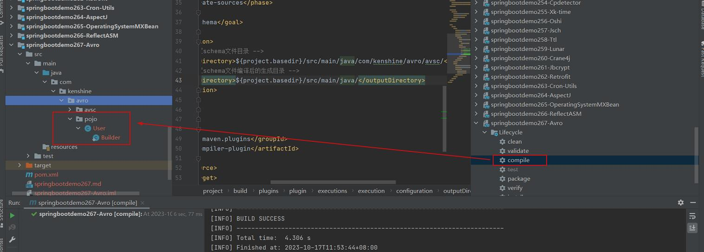

# 参考地址
Avro之序列化
- https://zhuanlan.zhihu.com/p/370519371

AVRO的简单使用
- https://www.freesion.com/article/9149171286/

# 1.生成类
- 编写.avsc文件
- maven-compiler生成类

# 2. 概述
Avro是Hadoop中的一个子项目，其是一个数据序列化系统。这里我们主要介绍下其在序列化方面的应用。与其它序列化方式相比，其一方面具备与编程语言无关的特性，另一方面序列化后的数据文件体积较小