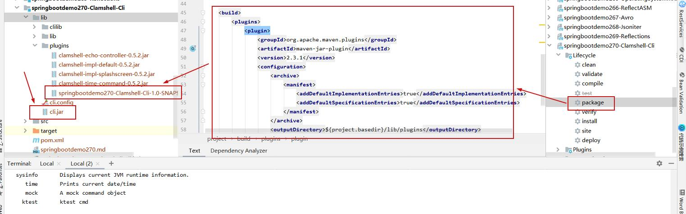

# 参考地址
github clamshell-cli
- https://github.com/vladimirvivien/clamshell-cli

- 下载源码，编译，打包生成clamshell-api-0.5.2.jar和clamshell-impl-core-0.5.2.jar，放到lib目录下，Maven引入本地jar

# 使用方式：
- 编写自定义命令
- SPI方式加载service：META-INF/services中配置
- 打包jar文件放到plugins/下
- 启动java -jar cli.jar
- 输入help可以看到自定义的命令列表

命令行要素：
- A Splashscreen: 界面
- Console IO：控制台IO
- Prompt：提示
- Input Controller：输入控制器
- Command Handlers：命令处理器

