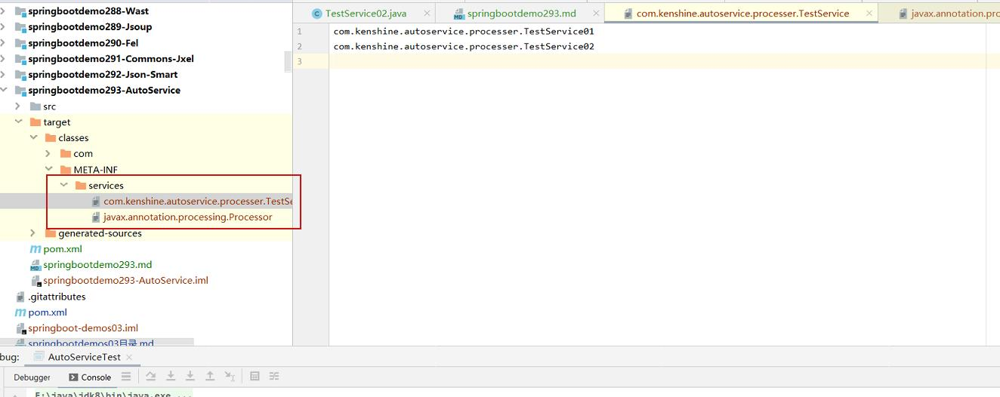

# 参考地址
Android Google AutoService框架使用详解
- https://www.jb51.net/article/267482.htm

# 编译过后的文件自动生成SPI

# APT
APT其实就是Java给我们提供的内置的SPI接口，作用是在编译java前处理java源码中的注解。
APT的服务接口就是这个javax.annotation.processing.Processor