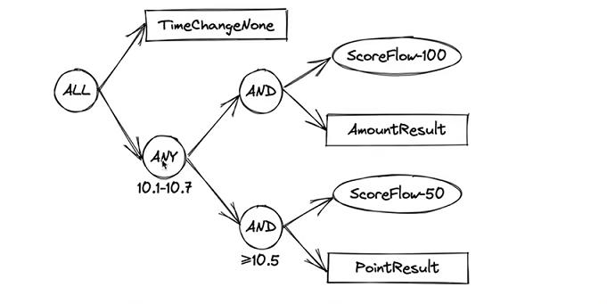
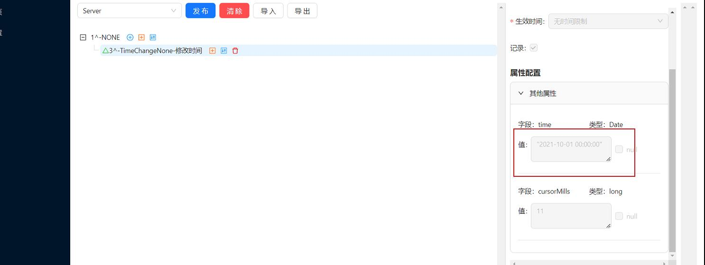
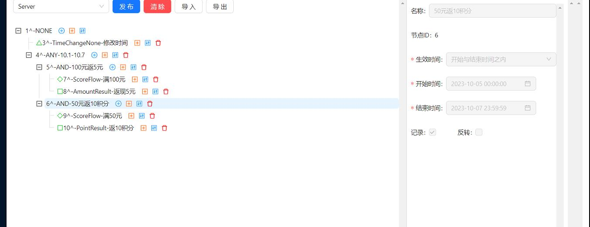
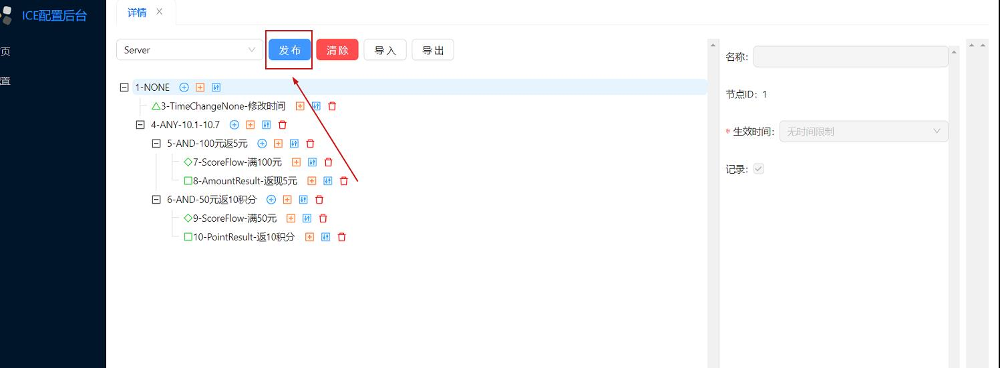

# 参考地址
官网
- http://waitmoon.com/zh/guide/getting-started
- https://www.bilibili.com/video/BV1Q34y1R7KF

# 简单使用
1. 创建数据库，导入sql
2. 下载ice,编辑配置文件并运行
    - http://waitmoon.com/downloads/
    - 修改配置文件数据库地址
    - `java -jar ice-server.jar --spring.profiles.active=prod` 启动
    - 后台管理地址：`http://localhost:8121/`
3. 整合Springboot,编写application.yml配置文件
4. 创建节点并启动项目：
    - AmountResult：余额节点
    - PointResult：积分节点
    - TimeChangeNone：时间变化节点
5. 在后台管理配置app,id与项目中的id相同

6. 在ice配置中心搭建节点树(Date类型设置值有bug)

配置完成需要发布

导出的完整配置在：resources\ice dump\dump.json

# 相关概念：
- roam：游荡字段，放置执行过程中存在的一些值
- Pack：可以包裹requestTime
- AND：任意为false则为false
- ANY：任意为true则为true
- 后台管理添加节点id可以复用配置
