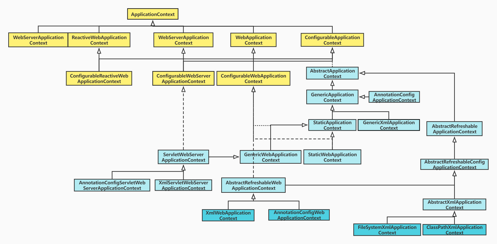

# 1.ApplicationContext简介
- 是spring继BeanFactory之外的另一个核心接口或容器，允许容器通过应用程序上下文环境创建、获取、管理bean
- 为应用程序提供配置的中央接口
- 在应用程序运行时这是只读的，重新加载需要自己实现

# 2.ApplicationContext提供的功能：
- 访问应用程序组件的Bean工厂方法 ListableBeanFactory
- 以通用方式加载文件资源的能力 ResourceLoader
- 向注册侦听器发布事件的能力 ApplicationEventPublisher
- 解析消息的能力，支持国际化 MessageSource
- 从父context继承。后代上下文中的定义总是优先级
   - 这意味着单个父上下文可以被整个web应用程序使用，而每个servlet都有自己独立于任何其他servlet的子上下文

# 3.ApplicationContext应用上下文体系

# 4.ApplicationContext的主要子接口(类)
- ConfigurableApplicationContext：提供了根据配置创建、获取bean的一些方法
    - GenericApplicationContext：持有单个内部DefaultListableBeanFactory实例的通用 ApplicationContext实现
        - StaticWebApplicationContext：用于测试的静态WebApplicationContext实现。 不适用于生产应用
    - AbstractRefreshableApplicationContext：支持对refresh()多次调用，每次都创建一个新的内部 bean 工厂实例
- ReactiveWebApplicationContext：响应式编程提供的接口
- WebServerApplicationContext：创建和管理嵌入式WebServer生命周期
- WebApplicationContext：为 Web 应用程序提供配置的接口,在运行时是已读的
- ApplicationContextAssertProvider：test包中，一个额外支持 AssertJ 风格断言的ApplicationContext 

几个重要的叶子类：
- XmlWebApplicationContext；它从 XML 文档中获取其配置，由XmlBeanDefinitionReader获取
- AnnotationConfigWebApplicationContext：它接受组件类作为输入——特别是@Configuration注释的类，还有普通的@Component类和使用javax.inject注释的 JSR-330 兼容类
- FileSystemXmlApplicationContext：独立的 XML 应用程序上下文，从文件系统或 URL 获取上下文定义文件,适用于测试工具以及独立环境
- ClassPathXmlApplicationContext：独立的 XML 应用程序上下文，从类路径中获取上下文定义文件

# 4.demo 获取ApplicationContext的几种方式
- demo01：@Autowired注入
- demo02：构造器自动注入
- demo03：ApplicationContextAware
- demo04：WebApplicationContextUtils

