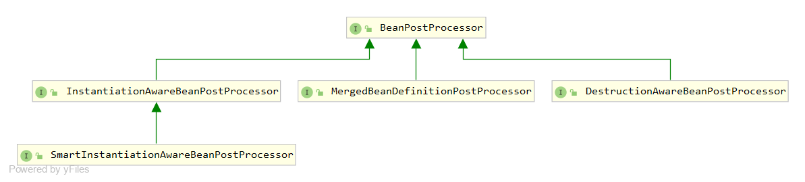

# 主要接口


# 1.BeanPostProcessor接口：
```java
//BeanPostProcessor 接口
public interface BeanPostProcessor {
    //在bean初始化之前
    default Object postProcessBeforeInitialization(Object bean, String beanName) throws BeansException {}
    //在bean初始化之后调用
    default Object postProcessAfterInitialization(Object bean, String beanName) throws BeansException {}
}
```

# 2.DestructionAwareBeanPostProcessor接口：
```java
//bean销毁前会调用
public interface DestructionAwareBeanPostProcessor extends BeanPostProcessor {
    //在Bean销毁前调用
    void postProcessBeforeDestruction(Object bean, String beanName) throws BeansException;
    //确定给定的 bean 实例是否需要此后处理器销毁
    default boolean requiresDestruction(Object bean) {}
}
```

# 3.InstantiationAwareBeanPostProcessor接口：
```java
//实例化前后做的事（先实例化才到初始化）
public interface InstantiationAwareBeanPostProcessor extends BeanPostProcessor {
    //实例化之前调用
	default Object postProcessBeforeInstantiation(Class<?> beanClass, String beanName) throws BeansException { }
    //bean实例化之后调用
	default boolean postProcessAfterInstantiation(Object bean, String beanName) throws BeansException {}
    //将给定的属性值应用于给定的 bean 之前对给定的属性值进行后处理，无需任何属性描述符
	default PropertyValues postProcessProperties(PropertyValues pvs, Object bean, String beanName) throws BeansException {}
    //@Deprecated 对属性值进行pvs修改 与上面接口作用相同，之后版本该接口会被删除
	default PropertyValues postProcessPropertyValues(PropertyValues pvs, PropertyDescriptor[] pds, Object bean, String beanName) throws BeansException {}
}
```

# 4.SmartInstantiationAwareBeanPostProcessor接口：
```java
//添加了用于预测已处理 bean 的最终类型的回调
public interface SmartInstantiationAwareBeanPostProcessor extends InstantiationAwareBeanPostProcessor {
    //判断bean类型
	default Class<?> predictBeanType(Class<?> beanClass, String beanName) throws BeansException {}
    //确定候选构造器
	default Constructor<?>[] determineCandidateConstructors(Class<?> beanClass, String beanName)throws BeansException { }
    //提前暴露引用，可以解决循环依赖问题
	default Object getEarlyBeanReference(Object bean, String beanName) throws BeansException {}

}
```

# 5.MergedBeanDefinitionPostProcessor接口：
```java
//对@Autowired和@Value的支持起到了至关重要的作用
public interface MergedBeanDefinitionPostProcessor extends BeanPostProcessor {
    //合并bean定义之后要做的事情
	void postProcessMergedBeanDefinition(RootBeanDefinition beanDefinition, Class<?> beanType, String beanName);
    //重置bean定义
	default void resetBeanDefinition(String beanName) {}
}
```

