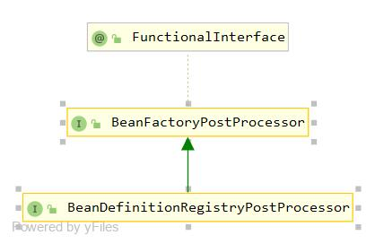

# 1.BeanFactoryPostProcessor类图

- BeanFactoryPostProcessor：在容器实例化**任何其它bean**之前读取配置元数据，并可以根据需要进行修改
    - 可以同时配置多个BeanFactoryPostProcessor，并通过设置'order'属性来控制各个BeanFactoryPostProcessor的执行次序
- BeanDefinitionRegistryPostProcessor：允许在BeanFactoryPostProcessor执行之前注册进一步的 bean 定义

# 2.BeanFactoryPostProcessor源码:
```
@FunctionalInterface
public interface BeanFactoryPostProcessor {
    //在所有Bean注册之前执行
    void postProcessBeanFactory(ConfigurableListableBeanFactory beanFactory) throws BeansException;
}
```

# 3.BeanDefinitionRegistryPostProcessor接口：
```java
public interface BeanDefinitionRegistryPostProcessor extends BeanFactoryPostProcessor {
    //在所有BeanFactoryPostProcessor执行之前执行
    void postProcessBeanDefinitionRegistry(BeanDefinitionRegistry registry) throws BeansException;
}
```

# 4.主要实现类：
- CustomAutowireConfigurer：自定义Qualifier的注册
- CustomEditorConfigurer：自定义PropertyEditor注册
- CustomScopeConfigurer：自定义Scope注册
- PropertyResourceConfigurer：允许从属性资源（即属性文件）配置单个 bean 属性值，可以覆盖context中的bean
    - PropertyPlaceholderConfigurer：用于“beanName.property=value”样式覆盖
    - PropertyOverrideConfigurer：用于替换“${...}”占位符
- LazyInitializationBeanFactoryPostProcessor：用于在未excluded且尚未显式设置值的 bean 定义上设置延迟初始化
- EventListenerMethodProcessor：将EventListener方法注册为单独的ApplicationListener实例
- ...
