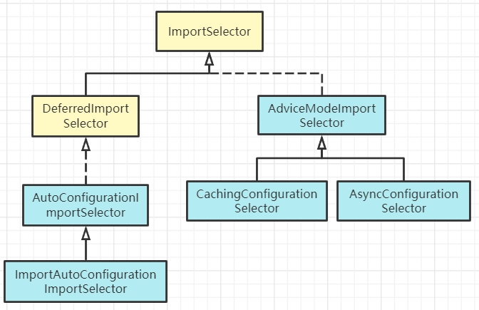

# 1.importSelector简介
导入选择器接口，简单来说就是选择导入那些类到IOC容器
- selectImports方法：选择并返回将要被@Configuration导入的类名
- getExclusionFilter：返回一个Predicate（结果为true则不视为配置类）

# 2.importSelector接口族

- DeferredImportSelector：在所有配置类中的Bean实例化后才会触发
    - 而importSelector在配置类bean之前实例化

# 3.相关类，接口，注解
- `@Import`：把类加入Spring IOC容器的注解，有三种使用方式
    - .class数组方式    `demo代码classes`
    - ImportSelector方式（Spring Boot底层采用比较得多的方式） `demo代码selector`
    - ImportBeanDefinitionRegistrar方式       `demo代码registrar`
- ImportBeanDefinitionRegistrar：动态注册bean，只能通过其他类@Import的方式来加载，通常是启动类或配置类
    - ClassPathBeanDefinitionScanner：一个 bean 定义扫描器，它检测 classpath 上的 bean 候选，使用给定的注册表BeanFactory或ApplicationContext 注册相应的 bean 定义
    - 官方就是用ImportBeanDefinitionRegistrar实现了@Component、@Service等注解的动态注入机制
- 三种导入方式区别：
    - 第一种、第二种方式在IOC容器中bean名称是类的全类名
    - ImportBeanDefinitionRegistrar是自定义的名称