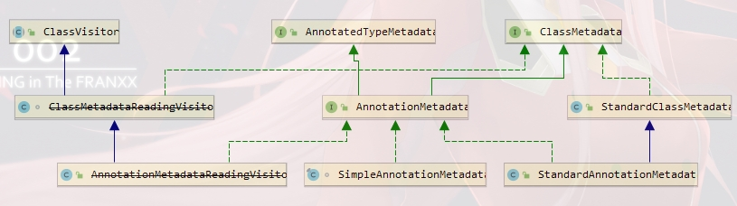

# 1.AnnotationMetadata类图

- AnnotationMetadata：注解元数据

# 2.AnnotationMetadata接口：新增了访问注解的相关方法
```java
public interface AnnotationMetadata extends ClassMetadata, AnnotatedTypeMetadata {
    //拿到当前类上所有的注解的全类名
    default Set<String> getAnnotationTypes() {}
    //拿到指定的注解类型 annotationName:注解类型的全类名
    default Set<String> getMetaAnnotationTypes(String annotationName) {}
    //是否包含指定注解
    default boolean hasAnnotation(String annotationName) {}
    //判断注解类型自己是否被某个元注解类型所标注
    default boolean hasMetaAnnotation(String metaAnnotationName) {}
    //类里面只有有一个方法标注有指定注解，就返回true
    default boolean hasAnnotatedMethods(String annotationName) {}
    // 返回所有的标注有指定注解的方法元信息。注意返回的是MethodMetadata 原理基本同上
    Set<MethodMetadata> getAnnotatedMethods(String annotationName);
    // 5.2 为类创建AnnotationMetadata的工厂方法
    static AnnotationMetadata introspect(Class<?> type) {}
}
```