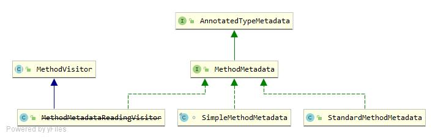

# 1.MethodMetadata类图

- MethodMetadata：方法元数据接口
    - StandardMethodMetadata：基于标注反射实现
    - MethodMetadataReadingVisitor：ASM实现
    - SimpleMethodMetadata：MethodMetadataReadingVisitor的替代实现 5.2

# 2.MethodMetadata接口
```java
// 获取方法元数据
public interface MethodMetadata extends AnnotatedTypeMetadata {
	String getMethodName(); //方法名
	String getDeclaringClassName(); //定义的类
	String getReturnTypeName(); //返回值类型
	boolean isAbstract();  //是否抽象
	boolean isStatic(); //是否静态
	boolean isFinal();  //是否final
	boolean isOverridable();  //是否被重写
}
```