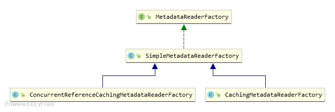

# 1.MetadataReader接口：门面模式
```java
//简单门面模式 
public interface MetadataReader {
    //返回class文件的IO资源引用
	Resource getResource();
    //为基础class读取基本类元数据，返回基础类的元数据
	ClassMetadata getClassMetadata();
    //
	AnnotationMetadata getAnnotationMetadata();
}
```
- 实现类：
    - SimpleMetadataReader：通过ASM的ClassReader实现

# 2.MetadataReaderFactory类图：

- MetadataReaderFactory：MetadataReader工厂接口
- SimpleMetadataReaderFactory：默认实现了MetadataReaderFactory的两个方法
- CachingMetadataReaderFactory：增加了本地缓存功能（HashMap）
- ConcurrentReferenceCachingMetadataReaderFactory：支持并发的缓存（ConcurrentReferenceHashMap）

# 3.MetadataReaderFactory接口：工厂模式
```java
public interface MetadataReaderFactory {
    // 通过类名创建MetadataReader
    MetadataReader getMetadataReader(String className) throws IOException;
    // 通过Resource创建MetadataReader
    MetadataReader getMetadataReader(Resource resource) throws IOException;
}
```


