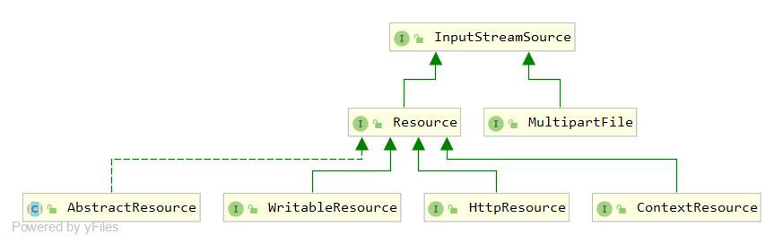

# 1. Resource类图：

- Java的标准java.net.url类和各种URL前缀的标准处理程序无法满足所有对低级别资源的访问
    - 如：无法获取ServletContext的classpath

# 2. 接口/抽象类简介
- InputStreamSource：仅提供了一个获取InputStream的方法
- Resource：提供了访问低级别资源的能力
- ContextResource：从封闭的context加载的资源的扩展接口
- WritableResource：支持写入的资源的扩展接口。 提供一个OutputStream accessor 
- HttpResource：要写入 HTTP 响应的Resource扩展接口
- AbstractResource：Resource实现的便利基类，预实现典型行为

# 3.重要实现类
- PathResource：Path句柄的Resource实现，通过Path API 执行所有操作和转换。 支持解析为File和URL
- InputStreamResource：给定InputStream Resource实现。仅当没有其他特定的Resource实现适用时才应使用
- DescriptiveResource：保存资源描述但不指向实际可读资源的简单Resource实现
- BeanDefinitionResource：BeanDefinition的Resource包装器
- FileSystemResource：文件系统资源
- ByteArrayResource：给定字节数组的Resource实现。为给定的字节数组创建一个ByteArrayInputStream 
- FileUrlResource：UrlResource子类，它假定文件解析，对于从File句柄或 NIO java.nio.file.Path直接构造，请考虑使用FileSystemResource 
- UrlResource：java.net.URL定位器的Resource实现
- MultipartFileResource：适配器模式，使Multipart适配Resource