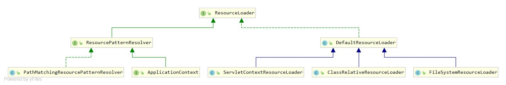

# 1.ResourceLoader概述
- Spring对物理资源的访问方式抽象成Resource，我们可以通过Spring提供的接口来访问磁盘文件等数据，Spring力争提供一个统一的接口来给编程人员使用
- ResourceLoader接口：用于实现不同的Resource加载策略

# 2.ResourceLoader接口

- ResourceLoader：用于实现不同的Resource加载策
- ResourcePatternResolver：getResources()方法用于根据传入的locationPattern查找和其匹配的Resource实例
- DefaultResourceLoader：默认实现
- ClassRelativeResourceLoader：根据传入的Class获取Resource
- FileSystemResourceLoader：根据文件系统路径获取Resource
- ServletContextResourceLoader：从ServletContext中获取Resource
- PathMatchingResourcePatternResolver：包含了一个对PathMatcher接口的引用，该接口基于路径字符串实现匹配处理
- ServletContextResourcePatternResolver：能够通过ServletContext.getResourcePaths在 web 应用程序根目录下找到匹配的资源

# 3.其他相关
- ResourceLoaderAware：注入ResourceLoader
- ResourceUtils：用于获取Resource的类

# 4.ResourceLoader源码
```java
public interface ResourceLoader {
    //获取resource
    //1.URL位置资源，如”file:C:/test.dat”
    //2.ClassPath位置资源，如”classpath:test.dat”
    //3.相对路径资源，如”WEB-INF/test.dat”
	Resource getResource(String location);
    //获取ClassLoader
	ClassLoader getClassLoader();
}
```

# 5.ResourcePatternResolver源码
```java
public interface ResourcePatternResolver extends ResourceLoader {
    String CLASSPATH_ALL_URL_PREFIX = "classpath*:";
    //返回匹配的Resource数组
    Resource[] getResources(String locationPattern) throws IOException;
}
```


