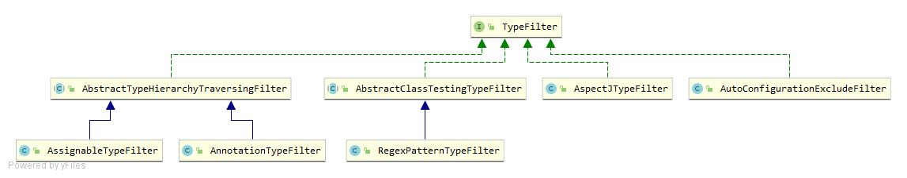

# 1.TypeFilter结构：

- TypeFilter：顶层接口
    - AbstractTypeHierarchyTraversingFilter:可以遍历层次结构的类型过滤器
        - AssignableTypeFilter：具体类型 FilterType.ASSIGNABLE_TYP的处理
        - AnnotationTypeFilter：根据注解过滤
    - RegexPatternTypeFilter：正则表达式过滤
    - AspectJTypeFilter：使用 AspectJ 类型模式进行匹配的类型过滤器

# 2.TypeFilter接口
```java
@FunctionalInterface
public interface TypeFilter {
    //是否匹配
	boolean match(MetadataReader metadataReader, MetadataReaderFactory metadataReaderFactory)throws IOException;
}
```

# 3.TypeFilter实现过滤流程
1. 创建：
    - ComponentScanBeanDefinitionParser::parseTypeFilters 将不同的Filter创建并加入到 ClassPathBeanDefinitionScanner 中
2. 执行：
    - ClassPathScanningCandidateComponentProvider(ComponentScanBeanDefinitionParser的父类)中：用于提供候选组件
    - ConfigurationClassParser::SourceClass：分析并产生配置类
        - 解析Configuration类定义，填充ConfigurationClass对象的集合