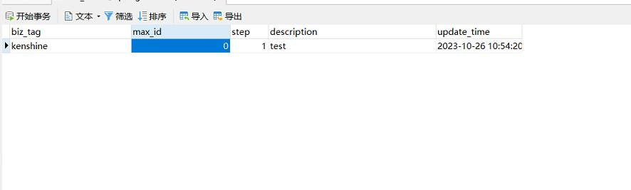

# 参考地址
Github
- https://github.com/Meituan-Dianping/Leaf/
- https://github.com/Meituan-Dianping/Leaf/blob/feature/spring-boot-starter/README_CN.md

源码：
- https://gitee.com/whisperofjune/wssnail-parent/tree/master
- https://blog.csdn.net/weixin_39555954/article/details/126571800

java 17环境+springboot2.5.1
# 使用
导入sql后需要添加配置：

