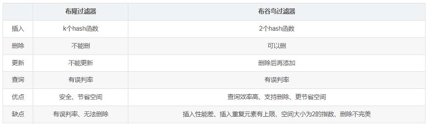

# 参考地址
https://github.com/MGunlogson/CuckooFilter4J

布谷鸟过滤器：实际上优于布隆过滤器
- https://blog.csdn.net/qq_43590614/article/details/117227345

# 简介

# 组成
- CuckooFilter
- CuckooFilter.Builder
- Utils
- Utils.Algorithm

# 特点
## 1. 可删除，可重复
重复8-9次插入后会插入失败，影响性能
   
## 2. 支持计数
但是受最大重复次数影响，7次

## 3. Hash
默认的哈希函数Murmer3不安全,会被hash冲突影响。安全功能包括SHA和SipHash

## 4. 多线程
所有操作都是线程安全的

## 5. 序列化
支持序列化