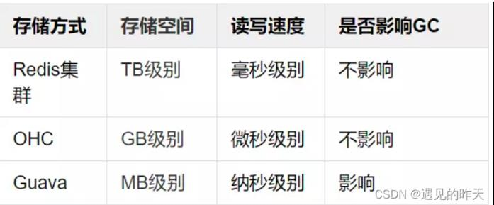

# 参考地址
堆外缓存是什么？ OHC 堆外缓存使用简介
- https://blog.csdn.net/qq_44787816/article/details/126939521

github
- https://github.com/snazy/ohc

# 简介
三种缓存对比：

# OHC支持大量配置选项： 详见OHCacheBuilder
- 总容量：capacity
- 段数量：segmentCount
- hash算法：hashAlgorighm
- 逐出算法：eviction

