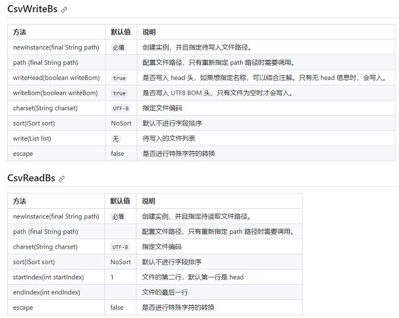

# 参考地址
CSV 基于 java 注解的 CSV 文件读写框架工具
- https://github.com/houbb/csv

# 简介
## 引导类
- CsvWriteBs：csv 文件写入引导类
- CsvReadBs：csv 文件读取引导类


## @CSV注解
- CsvTest/test02
- converter：自定义转换器

##集合支持
- CsvTest/test03

## 内嵌对象
- CsvTest/test04

## 特殊字符
- CsvTest/test05
```
原始	转义后
,	&CSV_COMMA;
`	`
:	&CSV_COLON;
=	&CSV_EUQAL;
```