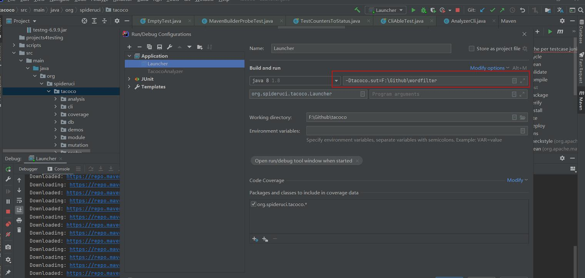

# 参考地址
tacoco 集成软件分析
- https://github.com/spideruci/tacoco/wiki

# 使用方式
1. 下载源码
2. 配置pom.xml
3. 运行launcher.java JVM参数如下

   
# 命令列表
    -Dtacoco.sut=<dir>		(Required) Absolute-path of system-under-test's root.
    -Dtacoco.listeners=<com.example.RunListener> ...Fully-qualified class name of the run listeners.
    -Dtacoco.inst=<*.jar>		(Required) Absolute path of jar reposnsible for instrumentation through a java-agent.
    -Dtacoco.inst.arg=<agent args>	(Optional) Arguments for the java agent in the instrumenter jar.
    -Dtacoco.inst.mem=<memory>	(Default: -Xmx1536M) Runtime memory for the instrumenter.
    -Dtacoco.inst.xboot=<classpath>	(Optional) -Xbootclasspath/p option for the instrumenter.
    -Dtacoco.home=<dir>		(Defalult: current dir) Tacoco's Home dir
    -Dtacoco.project=<string>	(Default: ID from sut's build system)MAVEN: GroupID.ArtifactID
    -Dtacoco.thread=<number>	(Default: 1) Number of JUnit Runner Thread
    -Dtacoco.log		 Prints Detailed Logs for Tacoco
    -Dtacoco.outdir=<dir>		(Default: tacoco.home/tacoco_out)
    -Dtacoco.db			Dump exec output to sqlite3 db file
    -Dtacoco.pit			Run PIT mutation test
    -Dtacoco.nojunit			Do not run junit test
    -Dtacoco.pitdb			Update TacocoDB with PIT mutation info
    -Dtacoco.debug			Launches the process, but waits for debugger to attach.
    -Dtacoco.help			Prints this message and exits (with 0).
