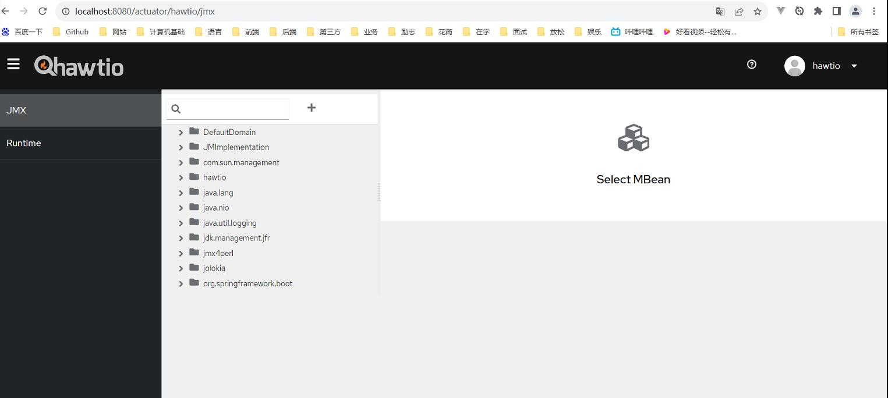

# 参考地址
hawtio
- https://github.com/hawtio/hawtio#running-a-spring-boot-app

官网
- https://hawt.io/docs/configuration/

java 11环境

# 说明
- 需要整合Spring-Security
- 在application.yml中设置密码
- 使用配置的账号hawtio 密码hawtio登录
- jolokia-access.xml：jolokia配置
- 登录地址：http://localhost:8080/actuator/hawtio

