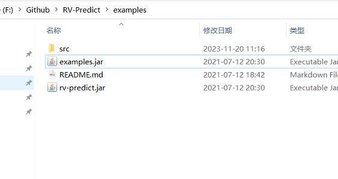

# 参考地址
官网，rv-predict 多线程竞争检测
-  https://runtimeverification.com/predict
-  https://runtimeverification.github.io/rv-toolkit-docs/predict/java/quickstart/
-  https://github.com/runtimeverification/predict/releases

五分钟简评为以太坊等动态分析审计的 Runtime Verification
- https://m.shilian.com/qukuailian/158183.html

# 使用方式
- https://github.com/runtimeverification/predict/releases 下载安装包
- java -jar .\rv-predict-installer-2.1.3-SNAPSHOT.jar 执行安装
- 复制jar包
  
- 运行命令：
    ```
    java -javaagent:./rv-predict.jar="--base-log-dir rv --log-dirname result" -cp examples.jar account.Account
    ```

- maven及run config配置方式：参考springbootdemo499-Ziptrack

# 参数说明
```
  --offline：告诉RV-Predict将记录的执行跟踪存储在磁盘上，并且只在应用程序终止后运行预测算法
  --base-log-dir <dir>：日志目录
  --log-dirname <dirname>：文件夹名称
  --include：告诉RV-Predict在检测中包含给定的包
  --exclude：排除包
  --window <size> (default: 1000)：告诉RV-Predict查找日志跟踪中距离<size>最大的事件之间的竞争
  --suppress 告诉RV-Predict抑制匹配给定正则表达式模式的字段的race报告
```