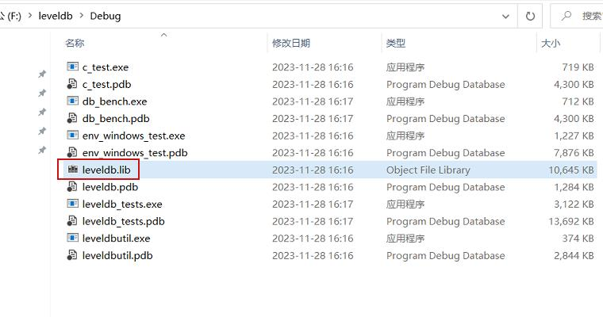

# 参考地址
windows下编译leveldb(动态库+静态库)
- https://codeantenna.com/a/WjSacd2QhL

fusesource/leveldbjni
- https://github.com/fusesource/leveldbjni

LevelDB 代码撸起来！
- https://blog.csdn.net/shellquery/article/details/100892940

LevelDB架构分析
- https://zhuanlan.zhihu.com/p/436037845

深入分析LevelDB存储引擎
- https://www.zhihu.com/column/c_1415344142814158848

# 编译安装
```
git clone git@github.com:google/leveldb.git
git clone git@github.com:google/googletest.git
git clone git@github.com:google/benchmark.git
cmake CMakeLists.txt
cmake -G "Visual Studio 17" CMakeLists.txt
```

# 动态编译的lib库


# 踩坑
## 问题一
```
CMake Error at CMakeLists.txt:7 (project):
  Running

   'nmake' '-?'

  failed with:
  
CMake Error: CMAKE_C_COMPILER not set, after EnableLanguage
CMake Error: CMAKE_CXX_COMPILER not set, after EnableLanguage
```
解决：
- https://zhuanlan.zhihu.com/p/497839595

MinGW-w64安装教程——著名C/C++编译器GCC的Windows版本
- https://zhuanlan.zhihu.com/p/76613134
- https://blog.csdn.net/weixin_41012767/article/details/129365597
- https://blog.csdn.net/fanjufei123456/article/details/129687829

## 问题二
```
CMake Error at CMakeLists.txt:9 (project):
  Generator

    Visual Studio 17 2022

  could not find any instance of Visual Studio.
```
解决：
- https://www.cnblogs.com/girakoo/p/17239680.html

## 问题三
No CMAKE_CXX_COMPILER could be found
- https://blog.csdn.net/yp18792574062/article/details/109196332