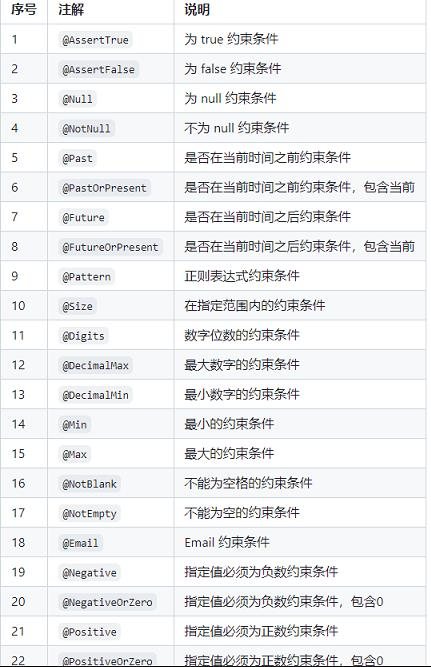
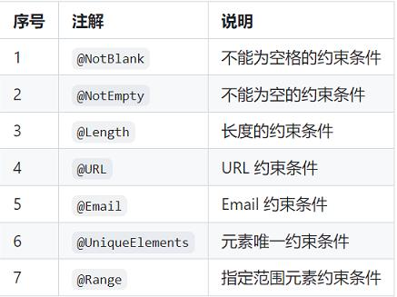

# 参考地址
validator
- https://github.com/houbb/validator

# 简介
## ValidHelper 验证
- failOver：全部验证后返回
- failFast：快速验证后返回
- failXXThrow：返回报错信息

## 内置注解
- @AllEquals：当前字段及其指定的字段 全部相等
- @EnumRanges：当前字段必须在枚举值指定的范围内
- @HasNotNull：当前字段及其指定的字段 至少有一个不为 null
- @Ranges：当前字段必须在指定的范围内
- @ChinaPhone：中国手机号校验
- @ChinaIdNo：中国身份证校验

## jsr303注解


## hibernate-validator注解


## 条件注解
- @EqualsCondition：等于指定值的条件
    - @EqualsCondition(value = "create", fieldName = "operType")：operType等于create才会校验
- @NotEqualsCondition：不等于指定值的条件
- @AlwaysTrueCondition：永远生效的条件
- @AlwaysFalseCondition：永远不生效的条件

## 过程式接口
```
IResult result = ValidHelper.failFast("", Constraints.notEmpty());
```
- 所有的约束方法在 Constraints 工具类中

## 自定义注解
约束注解，条件注解
- annotation注解
- handler处理