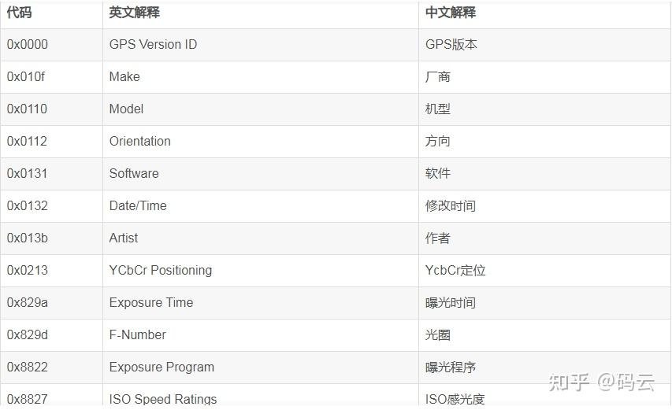

# 参考地址
metadata-extractor 从图像、视频和音频文件中提取Exif、IPTC、XMP、ICC和其他元数据
- https://github.com/drewnoakes/metadata-extractor

轻松获取图片和视频文件的Exif信息-Java篇
- https://zhuanlan.zhihu.com/p/574289312

# 简介
可以根据不同的Dictionary获取精准信息
- GpsDirectory
- ExifImageDirectory
- FileSystemDirectory
- ... 很多，详见源码

# exif文件解释

