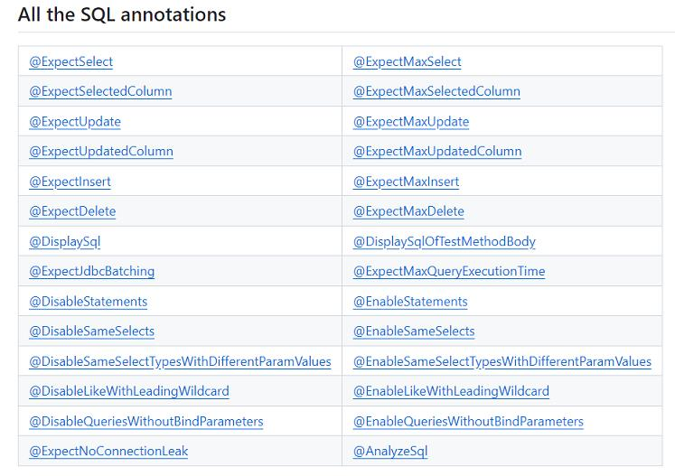

# 参考地址
quick-perf
- https://github.com/quick-perf/quickperf
- https://quickperf.io/

# 注解
## 核心注解
- @MeasureExecutionTime：执行时间
- @ExpectMaxExecutionTime：预期执行时间，超过则失败
- @DisplayAppliedAnnotations：显示应用的注解
- @DisableGlobalAnnotations：禁用全局注解
- @DisableQuickPerf：禁用QuickPerf注解
- @FunctionalIteration：功能相关的测试，也会禁用QuickPerf注解注解
- @DebugQuickPerf：显示调试信息

## JVM注解
- @HeapSize：使测试在给定堆大小的JVM中运行    
- @Xms：最小堆
- @Xmx：最大堆
- @UseGC：使用指定GC收集器
- @EnableGcLogging：打印GC日志
- @JvmOptions：指定JVM参数
- @MeasureHeapAllocation：打印堆分配数据
- @ExpectMaxHeapAllocation：最大可分配堆大小
- HeapDumper：输出堆信息
- @MeasureRSS：常驻集大小
- @ExpectMaxRSS：期望常驻集大小
- @ProfileJvm：打印JVM信息 openjdk支持
- @ExpectNoJvmIssue：需要openjdk支持

## Sql相关注解

- 需要整合jpa或者hibernate
