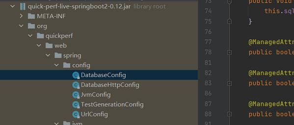

# 参考地址
quickperf-live quickperf与springboot整合
- https://github.com/quick-perf/quickperf-live

# 简介
自定义输出
- 实现 QuickPerfHttpCallInfoWriter 或 QuickPerfHttpCallWarningWriter 接口

# quickperf配置
查看源码：

- 目前仅支持这些配置
