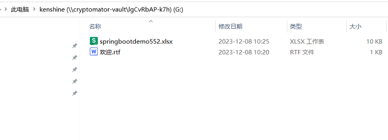
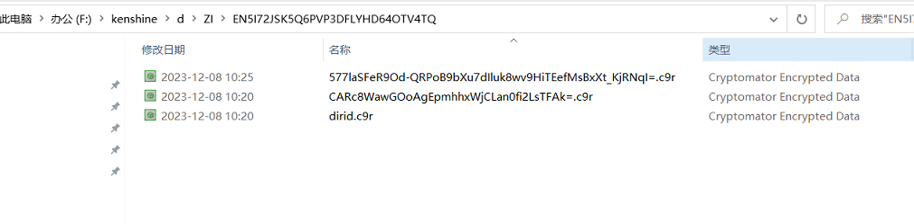

# 参考地址
官网
- https://cryptomator.org/
- https://cryptomator.org/downloads/win 下载客户端
- https://github.com/cryptomator/cryptomator
- https://github.com/cryptomator/cryptofs：java集成，从Java应用程序中访问Cryptomator加密的保险库

# 步骤
1. 下载安装并添加保险库

   
2. 在最新盘符上操作文件

   
3. 会在文件夹下生成加密文件

   
#  说明
## CryptoFileSystemProperties 初始化参数
- keyLoader：秘钥加载器
- vaultConfigFilename：vault配置文件，默认为vault.cryptomator
- masterkeyFilename：masterkey文件名，默认为masterkey.cryptomator
- flags：FileSystemFlags，仅支持readonly选项
- maxCleartextNameLength：最大明文长度，默认10240
- shorteningThreshold：缩短的阈值，默认220
- cipherCombo：密码元件
