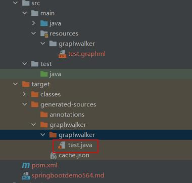

# 参考地址
graphwalker-project
- https://github.com/GraphWalker/graphwalker-project

基于模型的自动化测试工具GraphWalker（一）：基本原理
- https://blog.csdn.net/m0_37657841/article/details/88672453

基于模型的自动化测试工具GraphWalker（二）：使用介绍
- https://blog.csdn.net/BearStarX/article/details/96833934

基于模型的自动化测试工具GraphWalker（三）：应用案例
- https://blog.csdn.net/BearStarX/article/details/96835325

基于MBT的自动化测试工具——GraphWalker介绍和实际使用
- http://www.manongjc.com/detail/6-uhkyvuqqmwluwbo.html

# 简介
GraphWalker是一个基于模型的测试工具(MBT)，它使用有向图（有限状态图）。
这些图是系统预期行为的表达式。它不是对测试中的实际系统的描述，而是测试设计的表达。

# 模型
- 顶点(Vertex)：顶点表示我们想要检查的预期状态
- 边(Edge)：表示从一个顶点到另一个顶点的方法
- start顶点
- 标签(Lable)：标签是点或边上的所有文字描述
- Guard：guard是一种只与边相关的机制。他们的角色与if语句相同，并且使边有资格或者没有资格被访问
    - guard是一个用方括号括起来的JavaScript条件表达式 如：`[loggedIn == true]`
- 操作(Action)：要执行测操作
    

## 路径生成算法
- A Star
- Depth-first Search：深度有限算法
- Eulerian
- Fleury
- Floyd-Warshall

Generators路径生成器
- AStarPath
- QuickRandomPath
- RandomPath
- PredefinedPath

Machines：产生实际路径的机制

## 结束条件
- edge_coverage：边覆盖率达到多少
- vertex_coverage：顶点覆盖率达到某个值
- requirement_coverage：需求覆盖率达到某个值
- dependency_edge_coverage：高于依赖阈值的边都被覆盖
- reached_vertex( the name of the vertex to reach )：停止标准是指定的顶点。当在执行期间到达顶点时，测试停止
- reached_edge( the name of the edge to reach )：停止标准是指定的边。当在执行期间到达这条边时，测试停止


# 模型工具下载 编写.graphml模型文件
http://graphwalker.github.io/
- `java -jar graphwalker-studio-4.3.2.jar`
- 访问地址为：http://localhost:9090/studio.html

或者 https://www.yworks.com/products/yed
- https://cloud.tencent.com.cn/developer/article/2302114

# 测试步骤
1. 编写模型
2. 验证模型
```
java -jar graphwalker-cli-4.3.2.jar offline --start-element app_closed --model test.graphml "random(edge_coverage(100))"
```
3. 基于graphml文件生成java测试接口
- test.graphml放在resources目录下
- 使用graphwalker-maven-plugin插件graphwalker:generate-sources生成
- 生成目录在target/generated-sources/graphwalker下

- 生成的是测试接口，需要编写实现类
  - 如果是web应用，可以使用Selenium Web Drive
  - 如果是桌面应用，可以使用Sikuli
  - 如果是app，可以使用Appium
  

