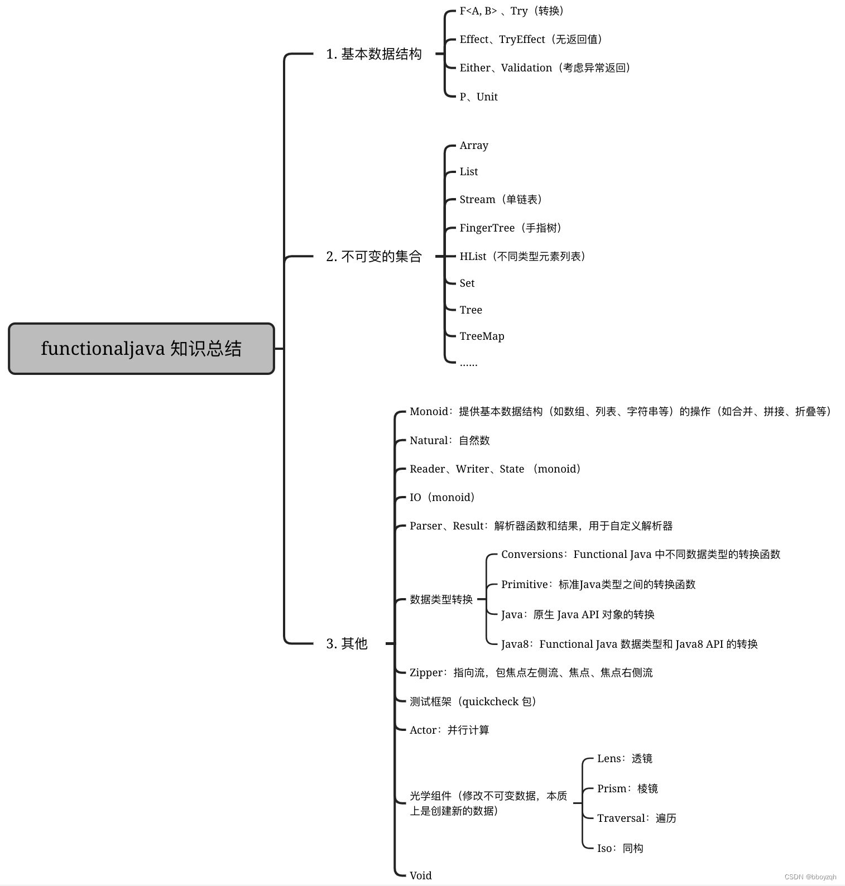

# 参考地址
github
- https://github.com/functionaljava/functionaljava

函数式编程框架 functionaljava 简介
- https://blog.csdn.net/zhuqiuhui/article/details/134498663

# 简介
functionaljava 框架是一个提升 Java 函数式编程的开源库，该库实现了许多基本和高级编程抽象，有助于面向组合式的开发

# functionaljava知识图谱

# 目录
BasicTest：基本接口使用
- test01F：F转换接口
- test02Try：TryF转换接口，抛异常
- test03Effect：Effect消费者
- test04TryEffect：TryEffect消费者，抛异常
- test05P：P生产者
- test06Unit：Unit仅含一个unit数据
- test07Option：0或1个值
- test08Either：两个值之一
- test09Validation：验证

ImmutableTest：不可变类
- test01Array：Array
- test02List：List
- test03Stream：Stream不可变惰性单链表
- test04FingerTrees：2-3指树
- test05HList：异构列表
- test06Set：Set
- test07Tree：玫瑰树
- test08TreeMap：红黑树实现的Map
- test09PriorityQueue：优先队列