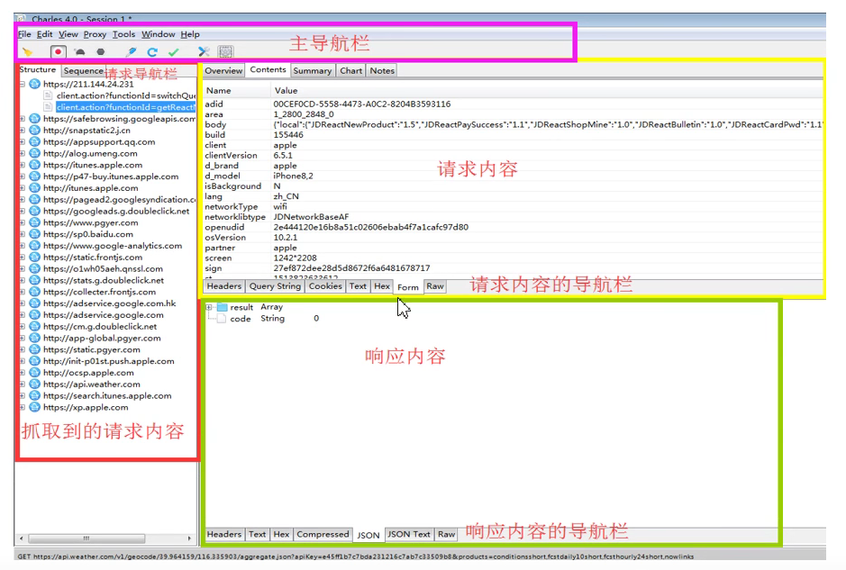
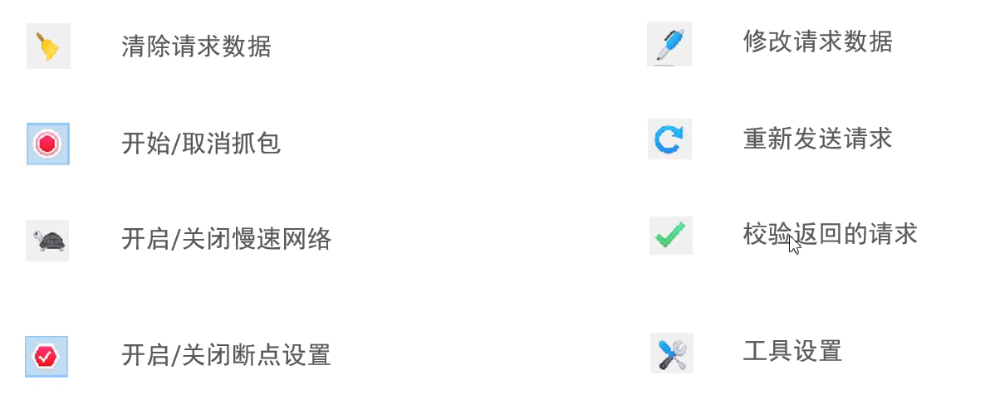
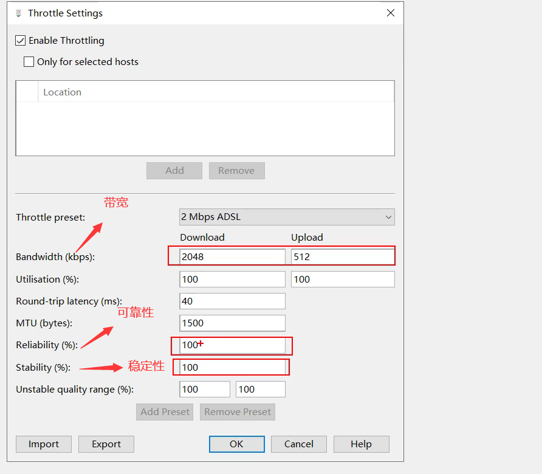
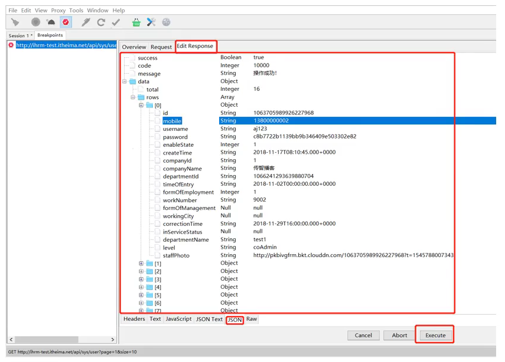

# 参考地址
https://www.yuque.com/weijinhuadechengxuyuan/hiw7ie

# 1.简介

Charles一款基于HTTP协议的代理服务器
- 能够用Charles来分析前后端的问题
- 能够用Charles模拟弱网测试环境
- 能使用Charles的断点构建异常的测试场景

# 2.安装与设置

https://www.charlesproxy.com/

破解：https://www.zzzmode.com/mytools/charles/

组件简介：

导航栏：

代理设置：Proxy—Proxy Settings

访问控制：Proxy—Access Control Settings

客户端：Windows代理设置：

- 1.在Chrome浏览器中输入chrome://settings
- 2.在搜索框中输入“代理“
- 3.点击“打开您计算机的代理设置“
- 4.在手动设置代理中开启代理
- 5.在地址输入框中输入Charles的IP地址以及端口
- 6.点击“保存”，关闭页面

# 3.使用

- 基本使用：设置好代理，浏览器运行即可

- Https抓包：需要安装SSL证书

  - help->ssl proxying->install charles root certificate

- Https代理配置：proxy->SSL proxying setting->Enable SSL Proying

  - add location填写`*.*`

- Charles流量配置：Proxy->Throttle Setting->Enable Throttling

  - Throttle preset选择网络类型
  - 

- 弱网测试：流量配置后进行测试

- Charles断点配置：Breakpoints

  - 右击接口链接，选择“Breakpoints”
  - 在浏览器刷新对应接口的页面
  - 此时会自动跳转到Charles并显示出接口请求信息
  - 点击“Edit Request”，修改请求的信息，点击“Execute“
  - 

  

