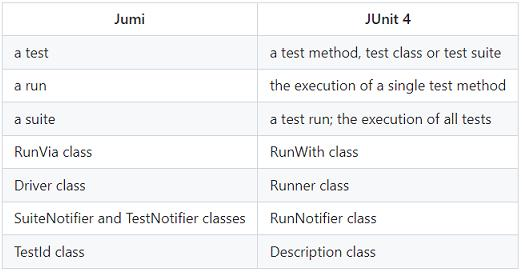

# 参考地址
jumi JVM的测试运行器,支持并行测试
- https://github.com/luontola/jumi
- https://jumi.fi/
- https://jumi.fi/actors jumi-actors支持并发编程
- https://github.com/luontola/jumi/wiki

# 简介
jumi与junit4对比
 

# 并行隔离技巧
- 单例
- 时间
- 套接字
- 共享数据库隔离
- 物理隔离
- 语义隔离

# 目录
- actors：并行测试
- RunningTest：jumi测试
- JunitRunTest：jumi执行junit测试

更多参考：springbootdemo602-Specsy：jumi+specsy整合使用