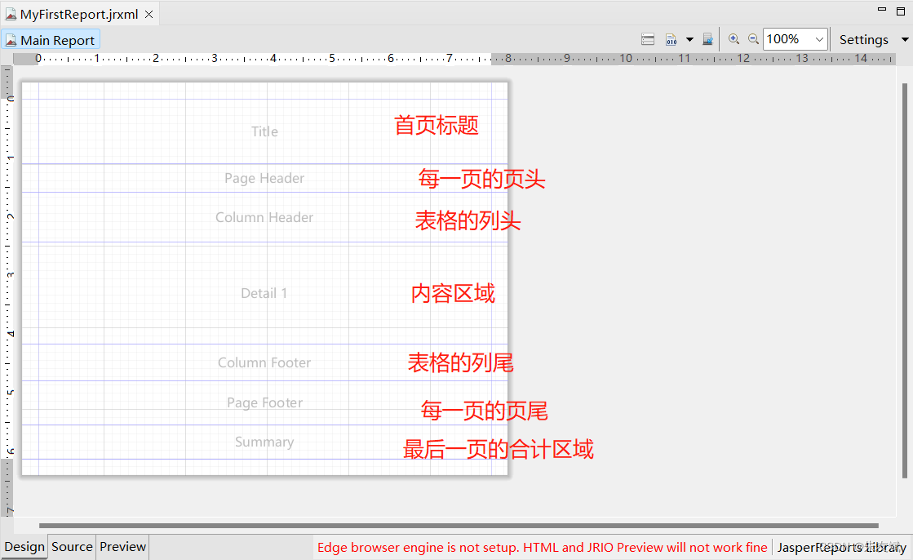
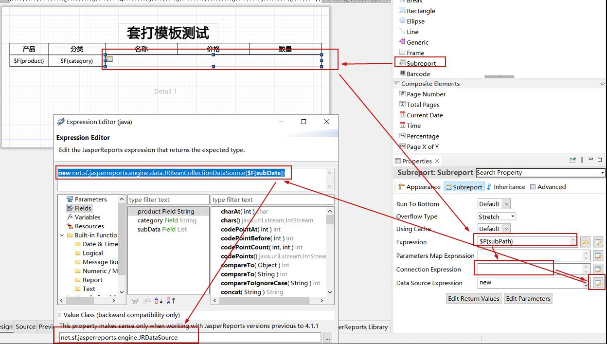

jasperreports工具

# 文本区域

- Title区域：这个区域只会在模板文件的第一页中显示，从第二页开始就不会显示，主要定义文件的标题内容。
- Page Header区域：这个区域是从第二页开始，每一页都会显示的页头信息，显示在每一页的最顶部。
- Column Header区域：当我们使用了Table组件的时候，Column Header区域才会生效，它表示的表格的列头，会在每一页显示。
- Detail区域：这个区域就是真正显示内容的区域，可以有多个Detail区域。
- Column Footer区域：当我们使用了Table组件的时候，Column Footer区域才会生效，它表示的表格的列尾，会在每一页显示。
- Page Footer区域：这个区域是从第二页开始，每一页都会显示的页脚信息，显示在每一页的最底部。
- Summary区域：这个区域是表示合计区域，只会显示在最后一页的末尾区域。

# 套打模板子报表设置

# 模板自带变量
- $V{PAGE_NUMBER} ：代表当前页数（可以是页码也可以是页数，通过TextField的计算时间的不同值来设置）
- $V{PAGE_COUNT} ：当前页面中记录的数目
- $V{groupname_COUNT} ：   代表当前组的记录数
- $V{COLUMN_NUMBER} ：列号码
- $V{COLUMN_COUNT} ：当前列中记录的数目（是当前页里行的序号，在新页上会重置为1）
- $V{REPORT_COUNT} ：当前文档中数据源记录数目。