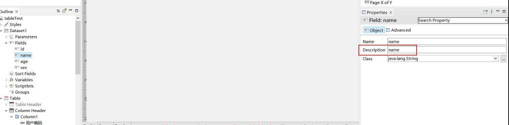

# 参考地址
主要学习
- https://www.cnblogs.com/xyyz120/category/1695447.html
- https://blog.csdn.net/lichongxyz/category_8740532.html
- https://blog.csdn.net/qq_34378595/category_11236304.html

JasperReports笔记系列
- 1、https://blog.csdn.net/qq_39826207/article/details/132198182
- 2、https://zhuyb.blog.csdn.net/article/details/132219255
- 3、https://blog.csdn.net/qq_39826207/article/details/132308348
- 4、https://blog.csdn.net/qq_39826207/article/details/132379227
- 5、https://zhima.blog.csdn.net/article/details/134450848
- 6、https://zhima.blog.csdn.net/article/details/134450809

# 下载
- https://community.jaspersoft.com/community-download
- https://sourceforge.net/projects/jasperstudio/files/

java8：jasperreports 6.7

# 开发步骤
1. jasperstudio 编写.jrxml模板文件
2. 编译为.jasper文件，引入项目
3. 结合数据填充，输出各种格式报表

# 踩坑
field的Description需要与map的key对应：

中文不显示
- fonts包
- jasperreports_extension.properties

java.lang.NoClassDefFoundError: main_report (wrong name: main_report_...)
- jasperreports依赖版本问题，需要与studio版本一致

程序加载不到主类JasperApplication
- 报表不能命名为main.jasper

java.lang.ClassNotFoundException: com.lowagie.text.pdf.FopGlyphProcessor
- itext版本问题，最终版本如本pom所示