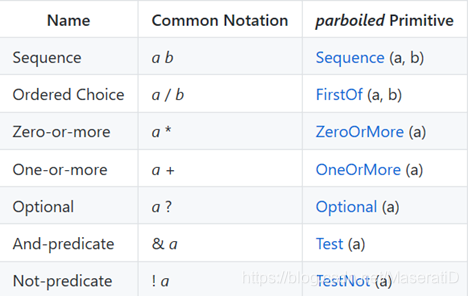

# 参考地址
parboiled轻量级PEG语法解析
- https://github.com/sirthias/parboiled
- https://github.com/sirthias/parboiled/wiki

Parboiled学习（一）
- https://blog.csdn.net/MaseratiD/article/details/102824691

# 简介
动机：老派解析器如Antlr太麻烦

parboiled特点
- 直接在Java或Scala源代码中进行语法定义
- 解析表达式语法的充分表达能力
- 支持强大而灵活的解析器操作
- 出色的解析错误报告和恢复
- 性能良好
- 容易集成
- 轻量级，使用简单

Parboiled提供了递归下降PEG解析器的实现，该实现可对用户指定的PEG规则进行操作

# 解析表达文法（PEG）
以纯公式的形式展现递归下降解析器的基础语法，对这个具体的解析器采用的实现方法没有限定。

与上下文无关文法（CFG）很像，但存在区别：
- PEG不存在二义性，只产生一个确定的语法分析树。
- PEG的选择操作符是有序的。如果第一个可能成功了，那么第二个可能就忽略。

对应正则表达式：

优点
- PEG更加严格更加强大，可以很好地成为正则表达式的替代品。
- PEG不存在二义性。

缺点
- PEG不能表达左递归的解析规则。
- 未能被广泛应用。

# 使用Parboiled的两个阶段
- 规则构建
    - 以Parboiled的方式构建解析器规则的树 / 有向图。该阶段与实际的输入无关，且构建的规则树可重用
    -  从BaseParser派生一个自定义的类，并定义返回Rule实例的方法。这些方法从其他规则、终端、预定义原语和动作表达式构建规则实例
- 规则执行
    - 解析器需要包含解析器操作，即在规则执行期间的特定执行点的自定义代码片段。除了检查解析器状态以外，解析器操作通常还会构造解析器“值”，并且可以作为语义谓词影响解析过程
    - 结果信息如下：
        - 确定输入是否匹配根规则的布尔标志
        - 可能遇到的错误信息列表
        - 由解析器操作构造一个或多个值的对象

# ParseRunner
负责监督解析运行并可选地应用额外的逻辑，最重要的是可以根据语法处理非法输入字符

五个预定义的解析器
- BasicParseRunner：不执行错误处理。（速度最快）
- ReportingParseRunner：为输入中的第一个分析错误创建一个适当的InvalidInputError对象
- RecoveringParseRunner：报告输入中所有的错误信息，并尝试恢复。（最复杂）
- TracingParseRunner：有选择地为每个匹配或不匹配的规则打印跟踪语句
- ProfilingParseRunner：产生关于解析器如何处理一个或多个输入

# 使用示例
- CalculatorParser：算数公式解析

