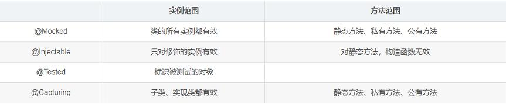

# 参考地址
jmockit java mock框架
- https://github.com/jmockit
- https://jmockit.github.io/

JMockit中文网
- http://jmockit.cn/index.htm

Jmockit的使用总结
- https://blog.csdn.net/qq_29698805/article/details/105588023

# 简介
Jmockit两种测试方式
- **基于状态的Mock**：主要使用MockUp和@Mock搭配使用实现Mock
- **基于行为的Mock**：行为模仿，主要使用@Test、@Mocked、@Injectable、@Capturing和Expectations搭配使用实现Mock
    - 录制、重放、验证
    
# 注解@Mocked, @Tested, @Injectable, @Capturing的区别与用法
## 注解@Mocked的说明
- 使用@Mocked可以修饰类、接口、抽象类。
- 使用@Mocked修饰，就是告诉JMockit生成一个Mocked对象，这个对象方法（包含静态方法，私有方法）都返回默认值。 
- 如果返回类型为原始类型（short、int、float、double、long），则返回0。
- 如果返回类型为String类型，则返回null。 
- 如果返回类型是其他引用类型，则返回这个引用类型的Mocked对象

## Expectations主要有两种使用方式
- 通过引用外部类的Mock对象(@Injectabe,@Mocked,@Capturing)来录制，对类的所有方法都mock了
- 通过构建函数注入类/对象来录制，把待Mock的类传入Expectations的构造函数，可以达到只mock类的部分行为的目的
- 详见ExpectationsTest

## @Injectable
- 注解@Injectable只针对其修饰的实例，所以对类的静态方法、构造函数都没有影响。因为它只影响某一个实例嘛。
- InjectableTest

## @Tested
- 使用@Tested修饰的类，表示我们要测试对象。JMockit也会帮我们实例化这个测试对象
- 在使用的过程中，往往将@Tested & @Injectable 搭配使用
- TestedAndInjectableTest

## @Capturing
- 主要用于子类/实现类的Mock我们只知道父类或接口时，但我们却需要控制它所有子类的行为时，子类可能有多个实现（可能有人工写的，也可能是AOP代理自动生成时），就用`@Capturing`
- CapturingTest

# 总结

