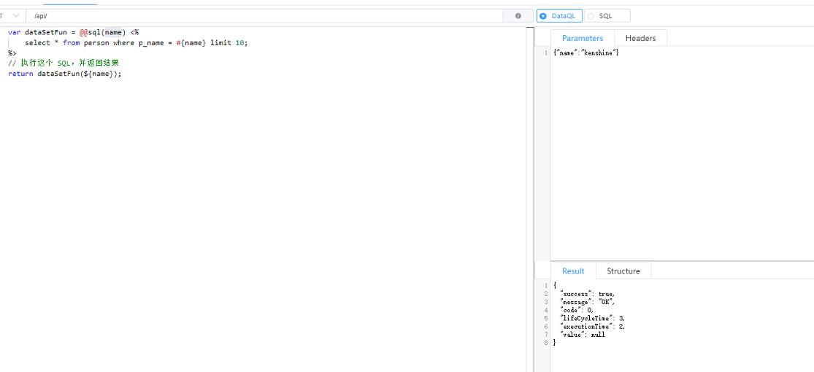
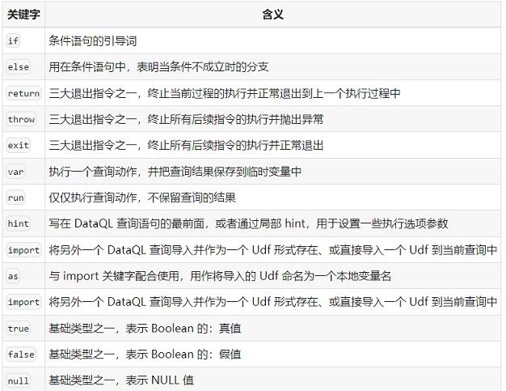

# 参考地址
- https://www.dataql.net/docs/dataql/overview

# 示例
```
var dataSetFun = @@sql(name) <%
    select * from person where p_name = #{name} limit 10;
%>
// 执行这个 SQL，并返回结果
return dataSetFun(${name});
```


# 关键字


# mybatis语法支持
```
// SQL 执行器切换为分页模式及首页页面设置
hint FRAGMENT_SQL_QUERY_BY_PAGE = true
hint FRAGMENT_SQL_QUERY_BY_PAGE_NUMBER_OFFSET = 1
hint FRAGMENT_SQL_PAGE_DIALECT = "mysql"

// 统一转驼峰
// 问题及说明2：通过下边的查询SQL测试得出结论，转驼峰的规则是，全部字母小写下划线后的字母大写，特别要注意的是【这里的驼峰只针对数据查询的字段，分页字段默认是驼峰的，下面附上测试】。
// default、upper、lower、hump
hint FRAGMENT_SQL_COLUMN_CASE = "hump" 

// 定义查询SQL
// 问题及说明3：对mybatis的支持并不完善，支持的标签有<select> <insert> <delete> <update> <if> 和<foreach>相关，<where>标签测试是不支持的。
// 问题及说明4：Date类型数据的查询，需要使用 TO_CHAR 函数，否则是毫秒值。
var dataSetFun = @@mybatis(keyword) <%
    <select>
        SELECT
	        p_id,
	        p_name
        FROM
	        person
        WHERE p_name is not null
        <if test="keyword != null and keyword != ''">
           AND p_name like concat('%','${keyword}','%') 
        </if>
        ORDER BY p_id
    </select>
%>

// 创建分页查询对象
// 问题及说明5：参数的传递规则，顺序很重要，从左到右是SQL内的参数顺序。
var pageQuery =  dataSetFun(${keyword},${pageSize},${pageNumber});
// 设置分页信息
run pageQuery.setPageInfo({
    "pageSize"    : #{pageSize}, 
    "currentPage" : #{pageNumber}
});
// 执行分页查询
var pageData = pageQuery.data();
// 查询分页信息
var pageInfo = pageQuery.pageInfo();
// 返回结果封装
// 问题及说明6：结果会封装到之前的value内。
return {
  "pageData" : pageData,
  "pageInfo" : pageInfo
};
```