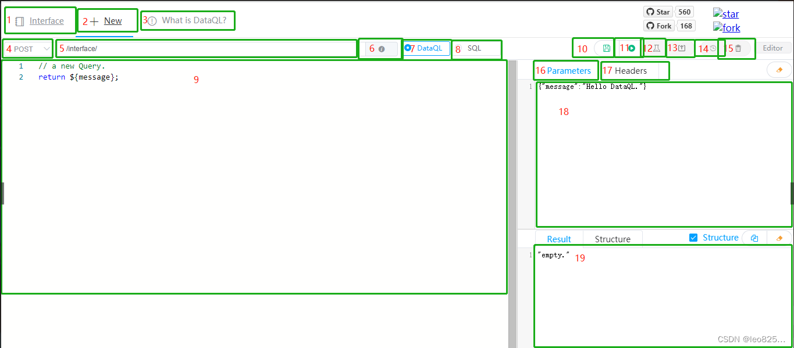

# 参考地址
Dataway 官方文档
- https://www.dataql.net/docs/dataway/ui/ui-list

SpringBoot笔记：SpringBoot集成Dataway
- http://www.bryh.cn/a/367158.html

Dataway 整合 Swagger2，让 API 管理更顺畅
- https://my.oschina.net/ta8210/blog/4293622

# 简介
Dataway 是依托 DataQL 服务聚合能力，为应用提供一个 UI 界面。并以 jar 包的方式集成到应用中。 通过 Dataway 可以直接在界面上配置和发布接口

# 访问地址
  - `localhost:8080/interface-ui/`：dataway
  - 账号密码：admin admin
- `localhost:8080/swagger-ui.html/`：swagger

# 踩坑
- swagger配置异常，打不开
  - 降低DataWay版本，使用4.1.8版本

# 页面

- 1、功能按钮：可以查看所有已经发布的接口
- 2、功能按钮：可以创建新的接口
- 3、链接：打开 DataQL 接口说明
- 4、请求方式：Http 请求方式定义，默认是 POST 方法
- 5、接口路径：定义接口的请求路径，/interface/ 为配置文件中 HASOR_DATAQL_DATAWAY_API_URL 属性事先定义的值，后面补充路径，当接口路径发布后，后面定义的接口请求路径不能重名
- 6、接口说明：可以为接口添加中文说明
- 7、使用DataQL编写接口，默认选择为 DataQL
- 8、使用 SQl 编写接口
- 9、接口编写代码部分
- 10、功能按钮：保存9部分编写的代码，注意只有先保存才能进行冒烟测试
- 11、功能按钮：测试按钮，当编写接口代码时，使用此按钮进行接口测试
- 12、功能按钮：冒烟测试按钮，通过了冒烟测试以后才能发布
- 13、功能按钮：发布接口，发布接口以后以后就可以通过发布的接口获取数据
- 14、功能按钮：接口编辑历史记录，可以通过历史记录回滚9区域的代码
- 15、功能按钮：删除按钮，点击删除后删除已经发布的接口（数据库中也会清除这条记录）
- 16、18功能区域：这个区域可以设置接口的请求参数例如通过 POST 方法传输一个请求报文，在此区域定义
- 17、功能按钮：设置接口的请求头参数
- 19、功能区域：测试接口区域，点击11测试按钮或者12冒烟以后在此区域显示测试结果