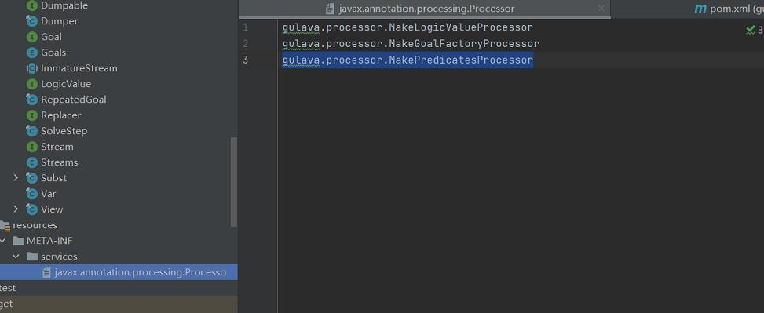

# 参考地址
gulava 关系编程库
- https://github.com/google/gulava
- https://github.com/google/gulava/wiki

Java注解编译期处理AbstractProcessor详解
- https://blog.csdn.net/agonie201218/article/details/130940854

# 使用方式
- clone gulava源码
- 编写/META-INF/services/javax.annotation.processing.Processor文件如下

- 打包jar
- 引入项目

# 相关类
- AbstractProcessor：注解编译期处理

# 踩坑
- 编译期注解处理失效： 
  - META-INF/services/文件夹而不是META-INF.services文件夹