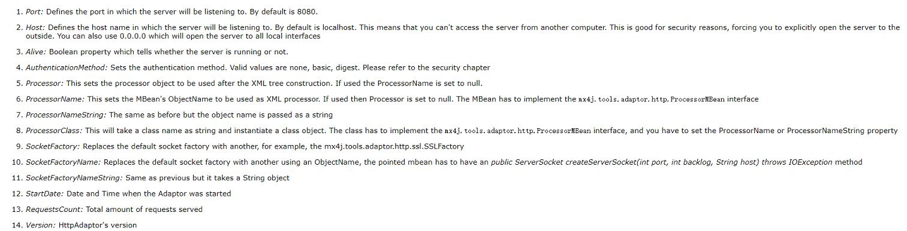

# 1.MX4J与JMX概述
- MX4J实现了JSR-003(JMX规范)与JSR-160(JMX远程规范)
- JMX定义了体系结构、模式、API和服务，以构建可管理的Java应用程序
    - JMX代理允许从本地或远程管理这些功能，允许系统管理员管理应用程序的组件
- MX4J其他功能实现：
    - Http适配器
    - ConfigurationLoader：从XML读取MBean配置
    - AbstractDynamicMBean
    - 有用的MBeans
    - 通过XDoclet自动生成标准MBean的管理接口
    
# 2.JMX1.2 总览 InvocationHandlerTest
- ObjectName变动
- 支持远程：MBeanServer/MBeanServerConnection
- MBeanServerBuilder:创建MBeanServer实例
    - mx4j.server.ChainedMBeanServerBuilder
    - mx4j.server.ChainedMBeanServer
- MBeanServerInvocationHandler： 通过动态代理调用，隐藏JMX调用的复杂性

# 3.JSR-160 (JMX远程) 总览 ConnectorServerTest
- MX4J允许您指定以下类型的JMXServiceURL
    - service:jmx:rmi://host
    - service:jmx:iiop://host
    - service:jmx:soap://host
    - service:jmx:local://host
    - service:jmx:hessian://host
    - service:jmx:burlap://host 
- JMXServiceURLs：JSR160连接器服务器由JMXServiceURL标识
    - `service:jmx: <protocol>://[[[ <host>]: <port>]/ <path>]`
- 通过JMXConnectorServer连接到MBeanServer
- JMXConnector处理注册通知侦听器和从远程MBeanServer接收通知的详细信息，并提供一种向JMXConnectionServer进行身份验证的方法
- RemoteNotificationClientHandler：

# 4.JSR 160安全性 JMXAuthenticatorTest
- JMXAuthenticator：可插拔身份验证机制
- 在SecurityManager下运行JMXConnectorServer可以微调远程客户端对它的访问
- 截取JSR 160 JMXConnectorServer和MBeanServer之间的调用
  - BeanServerForwarder
  
# 5.MX4J的 JMXConnectors 和 JMXConnectorServers MX4JServerTest
- SOAPConnectorServer
- HessianConnectorServer
- Https配置
- test06：远程服务端示例
- test07：远程客户端示例

# 6.MX4J Remote Tools 
- RemoteMBeanProxy：远程Bean代理
- ToolsTest
  
# 7.MX4J扩展 ExtensionsTest
- MBeanDescriptionAdapte：标准MBean描述
- MX4J实现通过可供MBean和应用程序使用的公共API公开了一些内部功能，仅Mx4j中能够使用
  - 灵活日志系统
  - LoggerBroadcaster：广播日志
  - MBeanServerInterceptor：自定义拦截器配置
  
# 8.MX4J HTTP Adaptor  HTTPTest
- HttpAdaptor：为XML数据而构建的，http适配器
  - HttpAdaptor配置：
    
  - HttpAdaptor操作：
    - start()、stop()、addCommandProcessor、removeCommandProcessor
- SSL支持：
  - 安装JSSE
  - 生成证书：`keytool -genkey -keystore certs -keyalg RSA`
  - 配置HttpAdaptor
- SSLFactory

# 9.MX4J Tools（ToolsTest）
- XML Configuration Loader：使用XML文件加载并启动MBeans
- AbstractDynamicMBean：动态MBean编写
- 命名MBeans，Mx4j自带了两个：
  - NamingService：允许在其他相同的JVM中进行rmiregistry
  - CosNamingService：允许在与其他MBean相同的JVM中启动tnameserv
- Mailer MBean：用于发送邮件`mx4j.tools.mail.SMTP`,使用方式
  - 直接通过调用sendMail方法
  - 通过监听器通知
- Jython MBean：执行jython脚本`mx4j.tools.jython.JythonRunner`，使用方式
  - 通过调用runScript方法
  - 通过监听器通知

# 10.示例
- test01：service
- test02：Mbean
- test03：rmi远程注册
- mx4j-examples包，非常详细